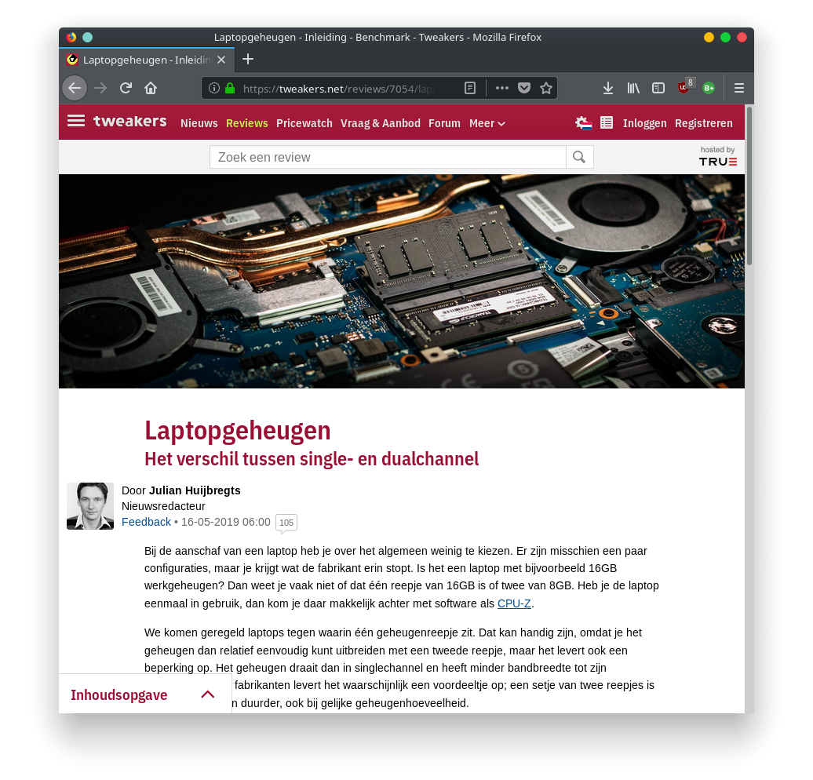
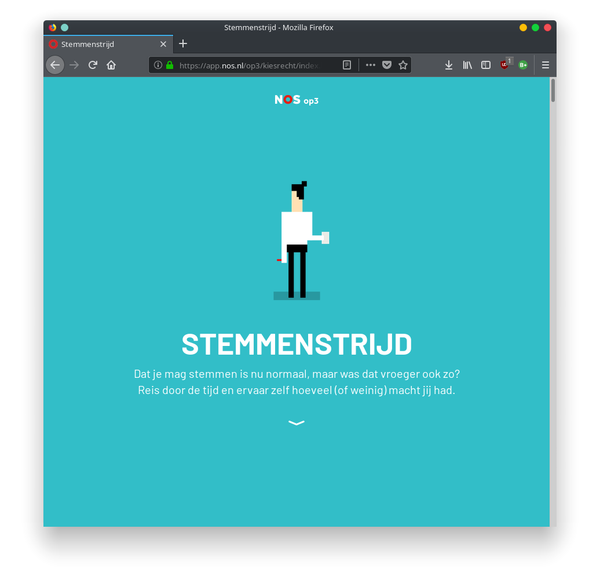
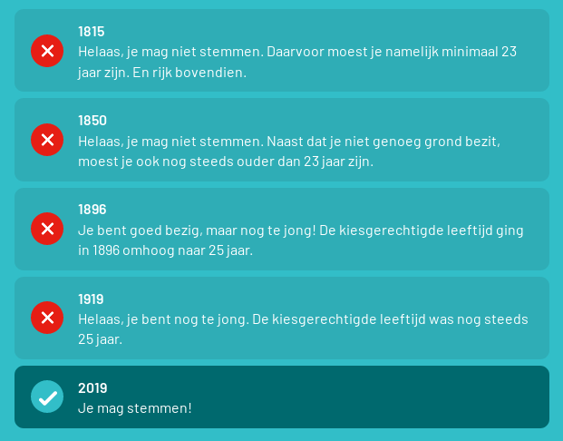

# College 2
## Theorie

### Goede Zakelijke Tekst

* De Inhoud is relevant 
* Bevat een centrale boodschap 
* Is gericht op een doel 
* Is lezer gericht, en afgestemd op de doelgroep. 
* Bevat een heldere structuur 
* Volledig, bevat alle onderdelen; 
* Goed en correct Nederlands

### Slechte Zakelijke Tekst

* Geen structuur 
* Geen hoofdboodschap (waar gaat het eigenlijk over?) 
* Niet lezer gericht. 
* Onoverzichtelijk 
* Doel onduidelijk 
* Schreeuwerig 
* Etc.

### Doel- en lezergericht schrijven 

1. Hoofdboodschap: Bepaal allereerst wat je werkelijk kwijt wil
	* Je hoofdboodschap is dat wat de lezer in ieder geval moet onthouden na het lezen van jouw tekst. 
	* Formuleer altijd vooraf in ongeveer twintig woorden de hoofdboodschap. 
	* De hoofdboodschap is de rode draad van de tekst.
2. Doel: Bedenk vooraf wat je wil bereiken met je tekst 
	* **Informeren** (kennis vergroten) 
	* **Overtuigen/beïnvloeden** (mening/houding/campagne) 
	* **Instrueren** (Instructies geven) 
	* **Activeren** (Tot actie aanzetten, aanschaffen/bestellen/op een button klikken) 
	* **Amuseren** (aan het lachen maken, dopamine vrijgeven) 
3. Doelgroep: Verdiep je vooraf in je lezer. Wie is je lezer? Welke vragen heeft je lezer? Wat wil jouw lezer weten over het onderwerp? 
	* Stem je tekst af op de lezer 
	* Schrijf lezer gericht 
	* Geef antwoord op de mogelijke vragen die de lezer bij het onderwerp kan hebben. 

### Tekstplan

* **Fase 1:** Formuleren van de hoofdboodschap, doelgroep en het doel. 
* **Fase 2:** Formuleren van de centrale vraag en deelvragen, de lezersvragen 
* **Fase 3:** Zet de lezersvragen in een logische volgorde en formuleer de antwoorden in trefwoorden. 
* Maak een indeling in hoofdstukken/paragrafen/alinea's, over deelvraag cluster van deelvragen. 
* Schrijf op basis van deze werkwijze de eerste en tweede versie. 

### Onthouden
Elke tekst bestaat uit: 

* Inleiding 
* Kern 
* Slot 
* Basisstructuur 
* Moet herkenbaar zijn (visueel te zien zijn) 

## Opdracht 1 - Nixie

> Opdracht: schrijf een wervende of informerende tekst van max. 400 woorden over een gadget: de NIXIE.Het doel, de doelgroep en de hoofdboodschap mag je zelf bepalen. Maak eerst het tekstplan t/m punt 5 en presenteer voor de klas. Tijd voor de opdracht: 15 min. Maak de opdracht de thuis.

**1. Doel, doelgroep, hoofdboodschap**

* Doel: Overtuigen om meer op te zoeken over dit apparaat/ informeren over hoe en waar je het voor kan gebruiken 
* De doelgroep: Actieve mensen die graag buitenkomen en dingen delen op social-media. 
* Hoofdboodschap: Er kom mogelijk een wearable drone op de markt. 

**2. Centrale vraag en deelvragen** 

* Centrale vraag: Welk product finalist is geworden bij de ‘intel make it wearable contest’. 
	* Deelvraag1: Wie is de persoon die deze wearable heeft uitgevonden? 
	* Deelvraag2: Hoe werkt het apparaatje, wat heeft hij gebouwd? 
	* Deelvraag3: Wat kun je er meedoen? 

**3. Volgorde deelvragen + antwoorden in trefwoorden**

Volgorde:

1. Wie
	- Team Nixie
2. Hoe werkt het
	- Drone om de arm
3. Waar kan het voor gebruikt worden
	- Snel foto’s/video's maken van een afstandje

**4. Hoe ziet de basisstructuur van de tekst eruit?**

* Inleiding
	* Wie heeft het product gemaakt en hoe? (Als een verhaaltje) 
* Kern
	* De centrale vraag en de overige deelvragen beantwoorden. 
	* Hoe werkt het apparaatje. Wat heeft hij gebouwd? 
	* Wat kan je er meedoen? 
* Slot
	* Waar kan je informatie vinden over dit product/de competitie. 

**5. Bedenk een kop + minimaal twee tussenkopjes**

* Kop: Er komt mogelijk een wearable drone op de markt.
* Tussenkopje: De werking van het apparaatje 
* Tussenkopje 2: Voor wie is het apparaatje bedoeld?

**6. Schrijf de tekst: Maximaal 400 woorden**

### Er komt mogelijk een wearable drone op de markt

Christoph Kohstall, een uitvinder uit San Francisco komt op een dag met het briljant idee om een 	drone te maken die klein genoeg is om om de pols te dragen. Hij kwam met het idee bij Jelena Jovanoic die hem vervolgens helpt om het project te managen en zich in te schrijven voor de 'Make it Wearable Contest' van Intel. Bij deze wedstrijd is het de bedoeling dat iemand een product ontwikkeld voor de toekomst, met als doel: zorg dat het product draagbaar is.

#### De werking van het apparaatje

Het apparaatje is een flexibele quad-copter van 10 cm die om de pols past. Het is gemaakt met een Intel Edison chip, een chassis, vier roterblades en een camera. Met één handbeweging komt de drone los van je arm, begint het op te nemen, voor een korte tijd van je af te vliegen, waarna het vervolgens weer op je afkomt zodat het je het apparaatje kan vangen en weer om je pols kan dragen.

#### Voor wie is het apparaatje bedoeld?

De wearable quad-copter is bedoelt voor iedereen die makkelijk korte afstandsfoto's wil maken zonder al te veel moeite en tijd te besteden aan het in de hand houden of opzetten van een camera. Tevens weegt de Nixie bijna niks en is het erg klein, het kan dus overal makkelijk mee naar toe worden genomen: zoals bij het beklimmen van rotswanden, surfen, een marathon of gewoon mee naar het strand.

Team Nixie heeft de 'Make it Wearable Contest' op 11 november 2014 gewonnen met als prijs: 500.000 dollar, technische ondersteuning van Intel, marktadvies, publiciteit en dit allemaal om het product te verbeteren en op de markt te krijgen.

## Opdracht 2 - Twee Webteksten
### Zoek twee webteksten die verschillen qua doel en doelgroep.

Tekst 1: https://tweakers.net/reviews/7054/laptopgeheugen-het-verschil-tussen-single-en-dualchannel.html

Tekst 2: https://app.nos.nl/op3/kiesrecht/index.html

### Geef het doel van beide teksten aan

**Het doel van tekst 1** is om de lezer te informeren over het verschil tussen de opzet van computergeheugen.

**Het doel van tekst 2** is om de lezer op een interactieve en persoonlijke manier te informeren en amuseren over hoe het stemmen in Nederland is ontwikkeld. Misschien ook wel om mensen te activeren om te gaan stemmen voor de aankomende verkiezingen.

### Analyseer de beoogde doelgroepen

**De doelgroep bij tekst 1** is duidelijk mensen die geïnteresseerd zijn in de technologie achter hun PC's. hieronder vallen bijvoorbeeld: gamers, tech-liefhebbers en computerwetenschappers.

**De doelgroep bij tekst 2** is veel algemener dan de doelgroep bij tekst 1, In principe is deze tekst voor iedereen bedoelt die maar geïnteresseerd is in de (vroegere) werking van het Nederlandse stemrecht.

### Op welke lezersvragen geven de teksten antwoord?

**Tekst 1**

* Het verschil tussen single- en dualchannel geheugen
* Prijs verschillen
* Resultaat van een aantal testen

**Tekst 2**

* Hoe heeft het stemmen in nederland zich ontwikkeld?
* Mocht jij vroeger stemmen?
* Wanneer zijn welke regels aangepast?

### Wat vind je goed en minder goed aan deze teksten? Heb je opmerkingen of suggesties ter verbeteringen? Licht je antwoord toe.

Wat ik mooi vind aan tekst 1 is dat het zo specifiek is dat je als tech-liefhebber goed geïnformeerd wordt over hoe het nou eigenlijk zit, zonder dat de tekst te oppervlakkig en laagdrempelig in informatie is. Omdat de doelgroep zo strikt is afgesteld heb je dus het voordeel dat je zo diep op de stof in kan gaan.

Wat ik goed vind aan tekst 2 is de interactiviteit. Omdat je aan het begin en halverwege de tekst een paar keer aan moet geven wat voor persoon je bent krijg je een gevoel dat de tekst meer op jou is afgestemd omdat er dan wordt aangegeven hoe de situatie bij jou zou zijn.

Een minpuntje bij tekst 1 (misschien een beetje te technisch) dat ze hun test enkel hebben uitgevoerd met de 'top of the line' processoren en geheugen die nu op de markt is, in plaats van met processoren en geheugen uit verschillende prijscategorieën.

Wat ik wel jammer vindt bij tekst 2 is dat ze door het hele verhaal heen vertellen dat je niet oud genoeg bent om te stemmen, en dan op het einde (met een verschil van 100 jaar) dat je ineens wel mag stemmen zonder uit te leggen bij welk tijdstip in het verhaal dit werd toegestaan.

