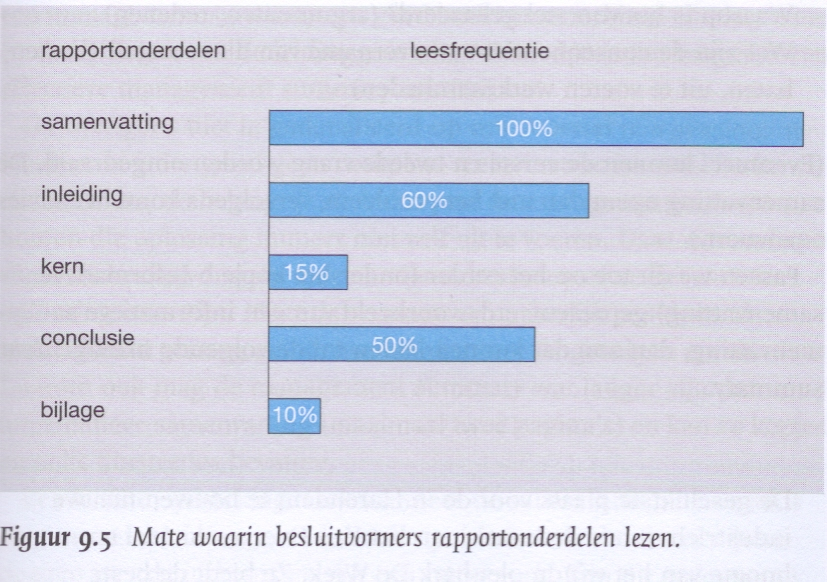

# College 2
## Theorie

* Voordat je een rapport gaat schrijven, moet je eerst weten welke onderdelen er allemaal in een professioneel rapport horen. Een rapport heeft een standaard indeling (deze indeling moet gewijze de hele opleiding worden gebruikt)

### Noodzakelijke rapportonderdelen

1. Omslag
2. Titelpagina
3. Samenvatting
4. Voorwoord
5. Inhoudsopgave
6. Inleiding
7. Hoofdstukken
8. Conclusie en aanbevelingen
9. Advies [optioneel]
10. Literatuurlijst
11. Bijlagen
12. Overige: Symbolenlijst, verklarende woordenlijst, register enz.

### 1. Omslag
> "You never get a second chance for a first impression"

* Professionele en aantrekkelijke vormgeving
* Verzorgd;
* Hard kaft of mapje
* Titel (en ondertitel) van het rapport;
* Illustratie / Logo's
* Naam van de schrijver(s).

### 2. Titelpagina

* Titel en ondertitel;
* Naam van schrijver(s)
* Naam van de school en de opleiding;
* Dagtekening (plaats en datum van publicatie);
* Eventueel: naam van het bedrijf, naam (namen) van de opdrachtgever(s) en/of begeleidende docent(en)
* NB: De titelpagina krijgt geen paginanummer, maar de nummering begint her wel.

#### Mate waarin besluitvormers rapportonderdelen lezen

### 3. Samenvattingen

**Drie types samenvatting:**

1. Abstract - zeer korte samenvatting, vaak bij wetenschappelijke teksten.
2. Informatieve samenvatting. Volgt de structuur van het rapport.
3. Managementsamenvatting / management summary. Speciaal geschreven voor  de decisionmakers. Komt snel met het probleem, advies en de voordelen voor de organisatie.

**Besteed zorg aan de samenvatting**

* is geen hoofdstuk en heeft geen nummer
* Maximaal twee A4, liefst een A4
* Moet zelfstandig te lezen zijn!

**Ad 2, de informatieve samenvatting**

* Geeft de lezer een totaalbeeld van het uitgevoerde onderzoek of de opdracht: van aanleiding t/m aanbeveling.
* Bevat naam van het bedrijf, aanleiding voor het onderzoek, doel- en probleemstelling, belangrijkste resultaten, conclusies en aanbevelingen.

### 4. Voorwoord

* Functie: geeft de lezer een beeld van het kader waarin het rapport geschreven is: In het kader van het project xx, vak, blok, opleiding enz.
* Geeft informatie over de doelgroep: voor wie is het rapport bestemd? Bij een gemengde doelgroep, bijvoorbeeld specialisten en decisionmakers > leeswijzer. Waar staat de voor hen relevante informatie.
* Ruimte voor persoonlijke elementen of persoonlijke passages over het verloop van het project, bijzondere omstandigheden, beperkingen, dankbetuigingen enz.
* Het voorwoord is geschreven in de ik-vorm of wij-vorm.

### 5. Inhoudsopgave

* Bevat een overzicht van alle onderdelen die **na** de inhoudsopgave komen.
* Het eerste genummerde onderdeel van de inhoudsopgave is de inleiding (Hoofdstuk 1 Inleiding)
* Zorg voor een overzichtelijke typografie en lay-out > alles laten lijnen.
* Geen pag.nr. opnemen op het blad Inhoudsopgave.
* Pag. nummering start fysiek bij de Inleiding. 
* Let op: de kern bestaat uit hoofdstukken + titels.
* Ook bijlagen + titels opnemen.
 
### 6. Inleiding

* De inleiding introduceert het onderwerp en eventueel de organisatie waar / voor wie de opdracht is uitgevoerd.
* Geeft een schets van de aanleiding voor de opdracht:
	- Achtergrondinformaite, korte beschrijving
	- van het probleem
	- en het belang van de oplossing van het probleem. (Er moet iets gebeuren want:)
* Formuleert de opdracht/praktijkvraag, doelstelling van de opdracht en het doel van het rapport;
* Bevat een operationalisering van de gehanteerde begrippen.
* Geeft een  vooruitblik op de inhoud van het rapport (van de hoofdstukken die na de inleiding komen).

#### Checklist inleiding:

1. Introductie onderwerp en organisatie
2. Aanleiding: Achtergrondinformatie, schets van het probleem, belang van de oplossing.
3. Beschrijveing van de ETC zie bb;

### Doel

* In de inleiding moet ETC. zie pp

* Een doel is een algemene motivatie voor iets;
* De doelstelling geeft aan wat er precies bereikt moet worden binnen een bepaalde tijdsperk

#### Voorbeeld

* Stel: Iemand wil een project opzetten om meer zwerfuil uit groningen te halen.
	- Het doel is dan dat er minder zwerfvuil is in Groningen
	- De doelstelling luidt: binnen twee maanden is er 50% minder zwerfvuil in Groningen.
	
#### Toelichting doelstelling opdracht

* Een probleem kan heel groot zijn.
* Je kunt vaak niet het gehele probleem oplossen.
* Je kiest een deel van het probleem ETC zie PP

* Het doel moet SMART geformuleerd zijn.

### 7. Kern

* Alles wat nodig is om de opdracht uit de inleiding uit te voeren.
* De hoofstukken en paragrafen hebben een decimale nummering.
* Elke hoofdstuk befint met een korte inleiding!
* Elk hoofdstuk eindigt met een slotpassage.

### 8. Conclusie

* > Korte terugblik op het voorgaande, = korte samenvatting
* Terugkoppeling naar de probleemschets.
* NOG IETS ZIE PP

### 10. Literatuurlijst

* Alle geraadpleegd bronnen (publicaties, digitale bronnen) vermeld je op alfabetische volgorde in de literatuurlisjt.

### 11. Bijlagen

* Elke bijlagen geef je een nummer + titel.
* Bijlage 1: Titel
* Bijlage 2: Titel

### Vereiste schrijfstijl

* Toon . Stijl: Professioneel, neutraal en zakelijk.
* Vermijd persoonlijk en studentikoos taalgebruik: ons groepje, ik-vorm, en toen deden we dit en toen dede NIET DOEN
* De eventuele bijbehorende aanbiedingsbrief is persoonlijk en gericht op de potentiële opdrachtgever: hier is de u-vorm toegestaan.

> Zie ook De Schrijfwijzer HBO-ICT

## Opdracht 1 - SMART (leer)doelen

> Schrijf in 5 minuten minimaal twee (leer)doelen op waar jij aan wilt werken. Het mogen zakelijke, studiegerelateerde of persoonlijke doelen zijn. De doelen moeten SMART geformuleerd zijn. Maak daarna duo’s en bespreek met je duo-partner of de doelen SMART genoeg geformuleerd zijn. Presenteer voor de klas en neem deze opdracht op in je portfolio.

* Ik wil binnen het eerste schooljaar 60 EC's halen.
* Ik wil binnen tien jaar 200% meer verdienen dan nu.

> Verbeter onderstaande formuleringen zodat de formuleringen SMART geformuleerd zijn.

* De gebruikers moeten via de webshop onze producten snel en gemakkelijk kunnen vinden.
	- Het overzicht van de webshop moet binnen 2 jaar worden aangepast waarop het makkelijker wordt om de verschillende producten te vinden.
* Wanneer de technisch beheerder reserveonderdelen bestelt, levert de leverancier deze binnen een redelijke tijd aan bij de telecomoperator.
	-  Wanneer de technisch beheerder reserveonderdelen besteld, dient de leverancier deze binnen 2 werkdagen te leveren bij de telecomoperator.

## Opdracht 2 - De Groene Bezorger

> zie [De Groene Bezorger](files/De Groene Bezorger case.docx)
