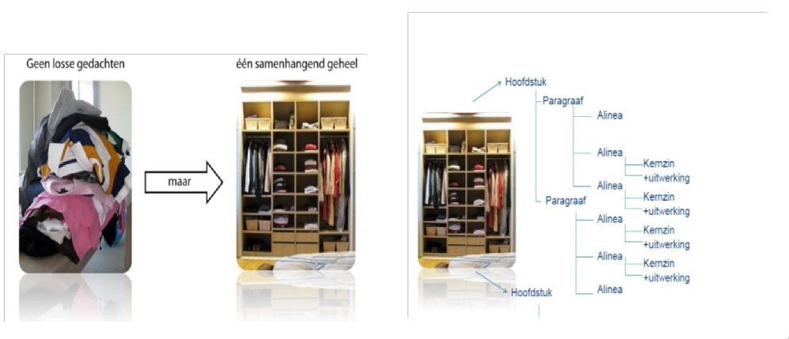

# College 4

> Deadline portfolio 17 juni 17:00

## Theorie

### Info Portfolio

1. Inhoud en volledigheid
	- Alle opdrachten + volgens de eisen zoals besproken in de colleges);
2. Lay-out en uiterlijke structuur
3. Toets Startvaardigheden minimaal 5.5 (met screenshot)

Alle onderdelen moeten voldoende zijn om de 2 EC toegekend te krijgen in Osiris.

### Volgende College

* Laatste college (29 mei, 9.30u):
	- Individuele schrijfopdracht in de klas op basis van de informatie en opdrachten voorafgaande colleges.
* **Let op!** College van 18 juni om 10:30 uur feedback! (ofterwel de eerst volgende college gewoon aanwezig zijn)

### Let op

* **Eindopdracht = verplicht!**
* Individuele schrijfopdracht in de les!
* Zorg dat je laptop is opgeladen!

### Voor de volgende keer

* Bestudeer hoofdstuk 2, 3, 4, 5 en 7 Rapportagetechniek
* Maak de weekopdrachten Computercriminaliteit en De Tuin en neem op in je Portfolio.
* Maak de college-opdrachten af en neem op in je portfolio.
* Neem alle PPT's tot nu toe door.
* Lees de case Parkeergarage op Blackboard.

### Het belang van schrijven

> “Docenten Nederlands baseren hun oordeel over een opstel vaker op uiterlijke kenmerken als handschrift en spelling dan op wezenlijke kenmerken als structuur. Toch zijn structuur en organisatie belangrijker omdat ze bepalen hoe gemakkelijk de grote lijn van een tekst te volgen is. Een tekst die slecht wordt gevonden vanwege de spelfouten, is geen slechte tekst omdat hij lastig te begrijpen is en daardoor communicatieproblemen veroorzaakt. Dat geldt wel voor een tekst waarvan de rode draad niet te volgen is.” - Prof. Dr. Ted Saunders, universiteit Utrecht



* Goed kunnen schrijven betekend: goed overbrengen wat jouw boodschap is.
* Goed kunnen schrijven stimuleert ook andere vaardigheden, zoals lezen, luisteren en spreken.
* Je leert je gedachten erdoor ordenen en daar heb je iets aan op elk terrein van de communicatie
* Bij elke les wordt aandacht besteed aan het schrijven van engels
* Kortom: Goed kunnen schrijven is erg belangrijk!

### Wat hebben we behandeld?

*Ga nooit zomaar schrijven. Bedenk van tevoren dit:*

* De centrale boodschap > waarom belangrijk?
* Doelgroep > welke hebben ICT'ers?
* Doel > welke soorten zijn er?
* Schrijf niet zendergericht maar lezer gericht.
* Pas op, de lezer heeft het druk
* Wie de lezer niet meteen en blijvend interessert is hem haar kwijt! (en dan heb jij je werk voor niet gedaan)

### Allereerst: De Inhoud bepalen

* Twee mogelijkheden:
	- Je weet weinig toet niet van het onderwerp
	- Je weet wat/alles van het onderwerp

#### Als je niets weet:

*...dan is het noodzakelijk je in het ondewerp te verdiepen*

* Je leest je in: Internet/Boeken/Artikelen
* Je bekijkt filmpjes (Youtube)
* Oftewel: Zoek uit wat/hoe/waar je onderwerp over gaat.

* Brainstormen
	- In **alle gevallen** is brainstormen goed

##### Topische vragen:

* Bij het mind-mappen kun je gebruikmaken van **topische vragen** ofwel onmisbare vragen.

##### Even afstand nemen

* Je hebt informatie vergaard en/of gebrainstormd
* Neem nu eerst even afstand: wat was ook alweer de centrale boodschap?
* Klopt die nog? Zo niet, stel hem bij.
* Waar het om gaat: in elke tekst moet je je **focussen**, ofwel: **maak een punt.** Je schrijft je tekst met een reden!

##### Hou de lezer in gedachten

* Hou te allen tijde de lezer in gedachten
* Schrijf niet op wat JIJ leuk vindt maar wat de lezer wil weten.
* Probeert vragen te bedenken die de lezer misschien zou kunnen vragen.

##### Onthoud:

* Structuur is belangrijk
* Een goede structuur bevordert de leesbaarheid.
* Voorbereiding is alles:
	- De meeste tijd zit in de voorbereiding
	- centrale boodschap
	- doelgroep
	- doel
	- bepaal de inhoud
	- structuur vaststellen
* Structuur zit 'm in:
	- duidelijke **hoofdstukindeling**;
	- heldere onderverdeling in **paragrafen**
	- die weer onderverdeeld zijn in herkenbare **alinea’s** die beginnen met een **kernzin**;
	- bondige en informatieve titels **hoofdstukken/ paragrafen**
	- glasheldere **tussenkopjes**. 
	
##### Maak een structuurschema

* Ofwel: Hoe bouw je je verhaal op?
* Probeer zoveel mogelijk een logische volgorde aan te houden.
* Behandel alleen de vragen waarvan je bedenkt dat ze relevant zijn voor de lezer.

**Tekstplan:**

Fase 1:  Formuleren van de centrale boodschap, doelgroep en het doel. 

Fase 2:  Formuleren van de centrale vraag en deelvragen > de lezersvragen.

Fase 3:  Zet de lezersvragen in een logische volgorde en formuleer de antwoorden in trefwoorden.
         
 >  Maak een indeling in hoofdstukken/paragrafen en/of alinea’s > per deelvraag / cluster van deelvragen.

**Opbouw van een alinea**

* In het begin van een alinea wordt meestal een bewering gedaan die in de rest van de alinea wordt uitgewerkt. (de kernzin)
* De Topische zin zit in zakelijke teksten meestal vooraan

> Rankschik je alinea's zo dat je bijvoorbeeld eerst alle positieve dingen zegt en dan in een andere alinea alle nadelen.

### Denk logisch

* Maak het schrijven niet te moeilijk. Het is niets anders dan je gedachten ordenen op papier.
* maar orden wel! anders een rommeltje
* Gebruik hierbij verbindingswoorden

### Ruwe versie

* Schrijf eerst een ruwe versie
* Onthoud: Fouten maken mag

### Voor de volgende keer

* Bestudeer hoofdstuk 2, 3, 4, 5 en 7 Rapportagetechniek
* Maak de weekopdrachten Computercriminaliteit en De Tuin en neem op in je Portfolio.
* Maak de college-opdrachten af en neem op in je portfolio.
* Neem alle PPT's tot nu toe door.
* Lees de case: Parkeergarage op Blackboard.

## Opdracht 1

```
#zie bb voor de volledige omschrijving en benodigde teksten.

Weekopdracht 4a: Computercriminaliteit

Opdracht
    1. Lees de volgende tekst over computercriminaliteit
    2. Welke alinea’s kun je in deze tekst aanbrengen?
    3. Bedenk een aansprekende titel en voor ieder tekstblok een goede tussenkop.
    
Weekopdracht 4b: De Tuin

Opdracht
	1. Haal het bouwplan of de vaste structuur uit de volgende tekst.
	2. Welke vaste structuur herken je?
```

## Opdracht 2

```
#zie bb voor de volledige omschrijving en benodigde tekst.

1. Waar staat de kernzin in de volgende alinea's?
2. Herschrijf de alinea.
3. Verzin een passende titel
```
