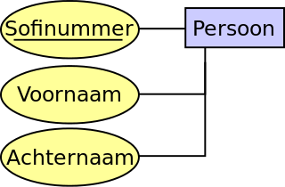

# Hoorcollege 1
## MySQL

### Er zijn 3 manieren om een database te realiseren:

* Conceptueel
	* Primarily for a business audience
	* defined using User Requirements  (n-n maakt niks uit)
	* Independent of a particular DBMS
* Logical Model
	* Independent of a particular DBMS
	* Entities, attributes and relations defined

* Physical database design
	* Tailored to a specific DBMS system.
	* Describes base relations, file organizations, indexes
	* Implmentation of non-functional requirements such as integerity.
	
### Types of Requirements

* Functioneel
	* IETS
* Non-functioneel
	* Wat moet de update zijn
	* Licenties
* Constraints
	* Constraints in relatie met solution en design (budget, tijd, technologie)

### Use Cases

* Use cases lead to queries (Gebruikersscenarios)
* Can you perform all queries? Are all foreign keys correct?
	* “Give all operations of surgeon X in hospital Y”
	* “How much was spend last year in hospital X on medicine for heart transplant operations”
* IETS

### Data Integriteit

* Intra-record integrity
	* enforcing contraints on contens of fields, etc. (Wat is de vorm van een atribute, een 			string of een integer, etc.)
* Referential Integrity
	* Wat gebeurd er als ik merel weghaal? Wat gebeurd er dan met de referenties in een 			andere tabel?
	* De valiteit tussen data in vereschillende tabellen/databases.
* Concurrency Control	
	* Er voor zorgen dat de integriteit van de database werkt in een multi-user environment
	* Hoe beter de integriteit des te lager de performance.

### Referential Integrity
* Foreign Key relations
* a student may own one or more cars.
* What if a student record is deleted?
	* Do not allow
	* Delete related records
	
### ER-Diagram

* Entities

### Primary and Foreign Key (Sleutel waarde en foreign keys)
* Candidate Key
	* Canidaten voor  Een set van attribute die deze rij uniek identificeren.
* Primary Key
	* Moeten voor elke rij een unieke waarde hebben
	* Een primaire sleutel is altijd een van de canidate key

### Attributen
* Lengte is een simple getal
* Een postal adres is en samenstelling van straat naam stad, ZIP en land
	* Multivalued Attributes
	* e.g. telefoonnummers

### Relations

* Branch has Staff (in UML)
* In UML worden inplaats van kraaie poten getallen gebruikt.
* De relatie heeft geen richting.
* De richting is een toevoeging voor de logica

### Coding Style
* identifiers and types should be written in lower case
* underscores separate words (snake_case)
* reserved words in UPPERCASE
* tables and views should always have a singular name, not plural.
* single column primary key fields should be named ‘id’
* foreign key fields should be a combination of
	* the name of the referenced table
* the name of the referenced fields

### Bedrijfsregels, relaties & Koppeltabel

* Bedrijfsregels zijn de relationele stijlen (1:n, 1:1, n:n)
* een koppeltabel is de primaire sleutels van de twee andere tabellen

1. Self Reference
	- (Werknemers, die kunnen bijvoorbeeld een manager hebben maar die zijn ook werknemers)
2. Foreign Key (Recursive)
	- Een student is onderdeel van een project en het project heeft een student als manager
3. Foreign Keys (Ternary Relation)

### Normalisatie

|Factuur|Klantnr|Datum|Product|Titel|Aantal|Prijs|Totaal|
|---|---|---|---|---|---|---|---|
|1101|12|10-10-2022|Appel|Titel|5|1,99|10,00|
|1102|12|01-10-2022|Peren|Titel|10|1,99|20,00|

**Normalisatie is het elimineren van data duplicatie**

* Regels voor databaseontwerp
* Redundantie in database voorkomen
* Incosistenties in database voorkomen
* Aanpassen van database vereenvoudigen

**Ongenormaliseerde data (0NF)**

* Een tabel met alle informatie.

**Eerste Normaalvorm (1NF)**

* De 0NF maar waar alle berekende gegevens en een primaire sleutel is gekozen.

**Tweede normaalvorm (2NF)**

* Moet voldoen aan de eerste normaalvorm
* Alle niet sleutel attributen zijn functioneel afhankelijk van de volledige primaire sleutel.
	* Oftewel als appels afhankelijk is van productid en niet van factuur id
* Partiële Functionele Afhankelijk zijn altijd in 1NF en 2NF
* Tabellen in 1NF met een enkele kolom als primaire sleutel zijn altijd 2NF

**Derde normaalvorm (3NF)**

* voldoet aan 2NF 
* Transitieve Functionele Afhankelijk C>D

**Denormaliseren**

* Normaliseren verbetert de integriteit van de data
* normalisere kan tenkoste van de performance gaan.
* tabellen samenvoegen en gegevens dupliceren
* Alleen doen als de performance aantoonbaar onvoldoende is.