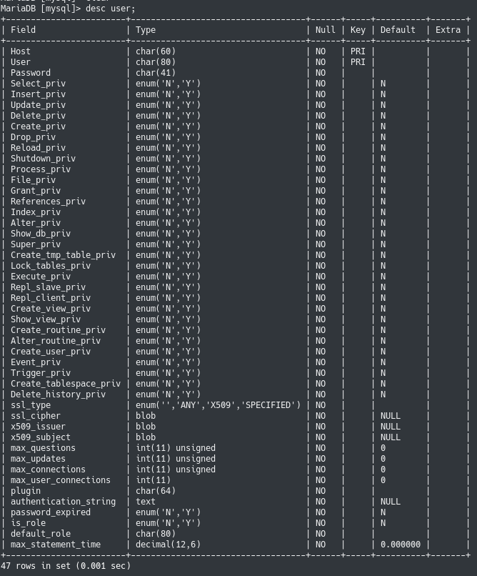
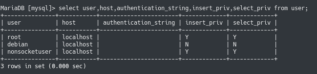

# Hoorcollege 3
### Rechten
Het primaire doel van access-control in MySQL is de authenticatie van een gebruiker die inlogt vanag een bepaalde host, en op grond hiervan bepaalde rechten op specifieke database toekennen.

**Twee toegangsstappen:**

**Stap 1:** op grond van de gebruikersnaam en het wachtwoord wordt een connectie met de database toegestaan of verworpen;

**Stap 2:** wanneer een connectie is gemaakt, wordt van elk statement dat je maakt gecontroleerd of je de juiste rechten hebt om dat statement uit te voeren.

**Zes Grant-tables:**

* **db**: privileges op database-niveau
* **tables_priv**: privileges op tabel-niveau
* **columns_priv**: privileges op kolom-niveau
* **procs_priv**:  privilegs voor stored procedures and functions
* **proxies_priv**: proxy-user privileges

db, en de user tabel lijken op elkaar.

**Grant statement:**

```
grant select on tweedekamer.kamerleden to ‘demo’@’localhost’ identified by ‘huppel’;
```

**Functies**

* now()
* round(waarde, aantalafrondgetal)
* concat(“abc”, “def”) string samenvoegen
* substr(‘abcdef’, 1, 4) = abcd (begint bij 1 te tellen)
* substr(‘abcdef’, 4) pakt alles naar de 4e tekens.
* Length() lengte van een string
* upper(‘abc’) zet alles in hoofdletters
* if(x = 1,  ‘true’, ‘false’) logische test
* ifnull(x, ‘dezewaarde’) als de waarde null is wordt het vervongen met ‘dezewaarde’

**Aggregatie functies**

```
SELECT avg(salary), max(salary), min(salary), count(salary), count(*)
```

**Groeperen**

* Hij groepeert eerst de waarden, en dan aggregeert hij erover heen.
* Je kan niet zomaar geaggregeerde functies gebruiken met gewone regels.
* Als je wilt filteren op aggregerende waardes gebruik dan HAVING inplaats van WHERE
	* Ofterwel wil je filteren voor de groupering gebruik dan WHERE

```
SELECT whatever, avg(salary) FROM employees WHERE job_id LIKE ‘%_MGR’
```

User tabel:



Users:

 
