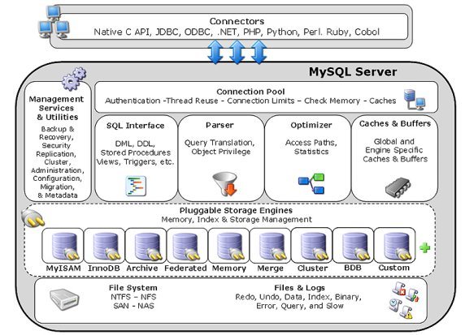
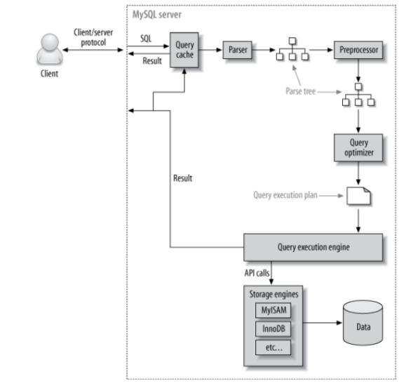

# Hoorcollege 5
## MySQL Query parsing and indexing



De volgende items gaan op tijd van links naar rechts:

* **Connection pool** handeld de verschillende verbindingen
* **SQL Interface** is de waarmee je met de database interact  (queries).
* **Parser** zet de ingevoerde string om in een werkende query.
* **Optimizer** zorgt ervoor samen met de parser ervoor wat de meest effectieve manier is om data op te halen.
* **Caches & Buffers** Zorgt ervoor dat niet altijd alles opnieuw uit de database moet worden gehaald.

Memory, Index & Storage Management

* **Storage Engine** De manier waarop de data moet worden opgeslagen.
* **File System & Files and Logs** Hier worden de bestanden van de database opgeslagen.

Je kan de storage engines laten zien met de query:
```
SHOW ENGINES;
```

* InnoDB: is stricter in de opslag van foreign keys
Hierdoor is InnoDB minder performance, sinds deze meer afdwingt bij de gebruiker.
* Blackhole: alle data wordt in /dev/null opgeslagen. (dus niet)

### What happens when MySQL executes a Query?

1. Client sends the SQL statement to the server (tcp port 3306)
2. Server checks the query cache; if there's a hit, it returns the stored result from the cache; otherwise, it passes the SQL statement to the next step.
3. Servers parses, preprocesses, and optimizes the SQL into a query execution plan (QEP)
4. The Query execution engine executes the plan by making calls to the storage engine API
5. Server sends the result to the client (and the result)



### Hoe wordt een query geparsed?

```
SELECT * FROM actor WHERE last_name = 'DAVIS';
```

Een query gaat gelukkig niet gewoon van boven naar beneden over de database totdat hij DAVIS tegenkomt.
Het voordeel van de data eerst sorteren is dat je gegevens in je database kan overslaan. D**it wordt gedaan doormiddel van een index.** Het is dus wel belangrijk dat de index op alfabetische volgorde blijft.

* Een index (meervoud: indices) is gebaseerd op de waarde van een of meerdere kolommen (de keys).
* Het aanbrengen van een index op een kolom maakt het  lezen (veel) sneller, maar het toevoegen van data een stuk langzamer (meeste applicaties lezen meer dan dat ze schrijven)
* Het opslaan van indices vraagt om geheugen (memory of disk space)
* De meest gebruikte index-vorm is een B-TREE (balanced tree)

### Balanced Tree B-TREE
> {5: "a", 12: "b"}

Als ik hier nou waardes wil toevoegen:


Zie: https://cstack.github.io/db_tutorial/parts/part7.html

> The B-Tree is the data structure SQLite uses to represent both tables and indexes, so it’s a pretty central idea. This article will just introduce the data structure, so it won’t have any code

### Index

* In MySQL (MyISAM en InnoDB engines) is de primaire sleutel altijd geïndexeerd.
* Als een query hebt met een ongeindiceerde kolom in een OR statement, kan er geen index gebruikt worden.
* Indices toevoegen op kolommen op volgorde: meest specifieke eerst (moet overeenkomen met de volgorde van het sorteren of groepen)
* Gebruik EXPLAIN om een beeld te krijgen van de manier waarop de query wordt verwerkt.
* Je moet niet gaan optimaliseren voordat de noodzaak ervoor aangekomen is.
* Bij een LIKE statement kun je geen indexen gebruiken. Dit betekend als ik exact weet hoe een string eruit ziet dat ik dan gewoon IS moet gebruiken.

```
SHOW keys FROM film;
```

Om een index te maken:

```
CREATE INDEX i_CountryCode ON city(CountryCode)
```

Om een index te verwijderen gebruik je:

```
DROP INDEX I_rating ON FILM;
```

### Views
* MySQL 5.0 introduced support vor views, stored procedures, cursors and triggers.
* A view is a virtual table that doesn't store any data itself.
	* From the client, a view behaves like a table.
	* The view can be used in a SELECT statement, just like any other table
* Views are defined as a SELECT query on one or more base tables (or other views)
* A view definition cannot contain a subquery in the FROM clause

* Views take very little space to store; the database only contains the definition of a view, not the data it presents
* Views and tables share the same namespace in MySQL
* Triggers cannot be associated with a view
* MySQL does not support materialized views.
	- A view where the query is executed and the data is stored in an actual table.

#### Example #1
* Create a view that stores data from other tables.

```
CREATE VIEW demoview AS [SELECT-STATEMENT/QUERY]
```
