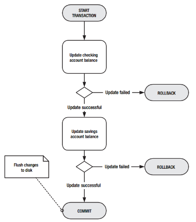
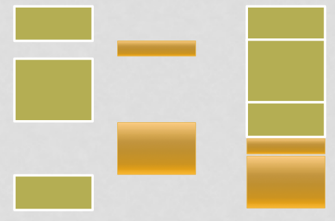
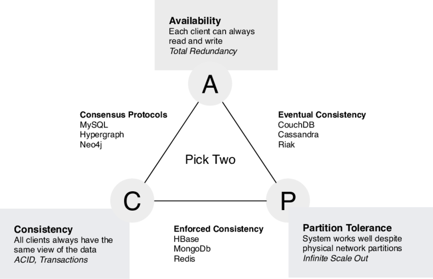

# Hoorcollege 7
## MySQL Triggers

Een trigger wordt uitgevoerd op het moment dat iets anders wordt gestart. bijvoorbeeld een update op een bepaalde tabel.

> De naam van de trigger is redelijk lang omdat er in beschreven wordt wat dat ding doet, en sinds je niet handmatig een trigger hoeft aan te roepen maakt de lengte niet uit.

```
DELIMITER $

CREATE TRIGGER before_update_apps
BEFORE UPDATE ON APPS
FOR EACH ROW 

BEGIN
	DECLARE oldval char(24)$
	DECLARE newval char(24)$
	
	set oldval = substr(OLD.wat, 1, 24)$
	set newval = substr(NEW.wat, 1, 24)$
	
	INSERT INTO logging values (now(), oldval, newval)$
END$

DELIMITER ;
```

* MySQL heeft op dit moment alleen maar row triggers
* OLD geeft de attribute voordat het is gewijzigd.
* NEW geeft de attribute nadat het is gewijzigd.
* Een Trigger kan gemaakt worden op een UPDATE, INSERT en een DELETE

> Functies, Procedures en Triggers werken samen om de integriteit van je database te behouden.

### Limitations

 * Cascaded foreign key actions do not activate triggers
 * It can be easier to define a stored procedure separately and then invoke it from the trigger using a simple CALL statement.
 * The trigger cannot use the CALL statement to invoke stored procedures that return data

### Syntax

```
DELIMITER \\
CREATE TRIGGER name
[ BEFORE | AFTER ]
[ INSERT | UPDATE | DELETE ] ON TABLE

```

## Database Transactions

* A transaction is a sequence of one or more operations (reads/writes) which reflect a single real-world transition
* Either happened completely or not at all
* Multiple statements can be grouped together as a transaction:

```
START TRANSACTION
	UPDATE Bank SET amount = amount - 100
	WHERE name = 'Bob'
	UPDATE Bank SET amount = amount + 100
	WHERE name = 'Joe'
COMMIT
```

> Het overschrijven van geld vereist meer dan een SQL statement.

### What is a transaction?



* A logical **unit of work** with one or more SQL statements
	- Guaranteed to be **atomic** with respect to recovery
	- Done in a coherent and **reliable** way
	- **Indepedent** of other transactions
* Changes made by transaction are **not visible** to other (concurrent) transactions until transaction completes
* transforms database from one consistent (logical) state to another 
* application program is series of transactions with non-database processing in between.
* note : physical state of the database refers to how database servers keep a copy of the data in memory (RAM) and on disk.
* Recovery & Durability: keeping the DBMS data consistent and durable in the face of crashes, aboert, system shutdowns, etc.
	- transactions are either durably stored in full, or not at all; keep log to be able to “roll-back” transactions.
* concurrency: achieving better performance by parallelizing transactions without creating anomalies.
	- disk accesses may be frequent and slow

> Een transactie mag niet afhankelijk zijn van andere data die in een andere transactie wordt geschreven. Hij moet het helemaal op zichzelf kunnen doen.

### ACID Properties of transactions

* **Atomicity**: 'all or nothing' property
* **Consistency**: must transform database from one *consistent state* to another (ensuring data integrity)
* **Isolated**: result of transactions parallel is the same as running transactions one after another.
* **Durability**: Effects of a commited transaction are permanent and cannot be lost because of later failure.

#### Atomicity

* A transaction can result in: 
	- success - transaction **commits** and database reaches a new consistent state
	- failure - transaction aborts, and database must be restored to consistent state before it started; such a transaction is **rolled back**
* committed transaction cannot be aborted
* **aborted** transaction that is **rolled back** can be restarted later

#### Consistency

* programmer defines scope of transactions, and makes sure a transaction takes a consistent state to a new consistent state 
* system makes sure that the transaction is atomic

#### Isolated

* A transaction is isolated from other transactions.
* A transaction should not depend on the results (or state) of another transaction.



#### Durability

* After a transaction completes, its results are persisted in the database.
* To undo the changes made by the transaction, a new transaction must be started.

### BASE Properties

* Opposite ACID we find database engines which propagate BASE properties.
* **B**asic **A**vailability
* **S**oft state
	- De database is misschien niet helemaal coherent, zolang hij maar werkt.
* **E**ventual consistency
	- Het moet uiteindelijk wel consistente data teruggeven

> Als twee mensen hetzelfde laatste boek in het mandje doen, dat dan uit eindelijk 1 van beiden een bericht krijgt dat hij het boek niet heeft kunnen kopen.

### CAP-THEOREM


