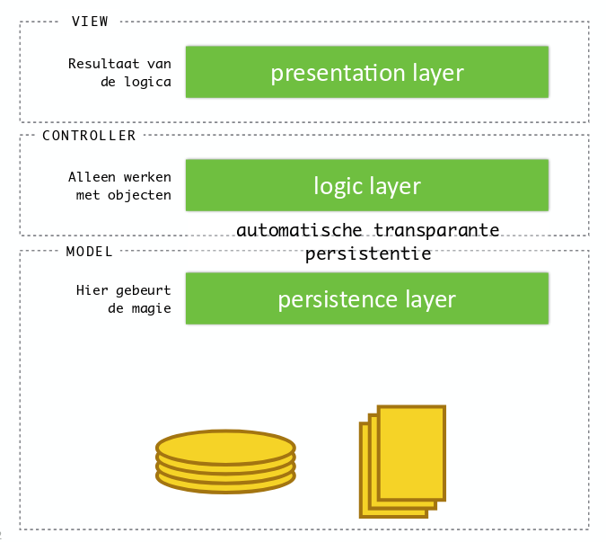

# Hoorcollege 8
## Database concurrency control and locking

* **isolation**: result of transactions parallel is the same as running transactions one after another. 
	- Prevents interference when two or more users are accessing same data at the same time, and at least one is updating data.

### Three types of conflicts

* Two actions conflict if they are part of different transactions, involve the same variable, and at least one of them is a write:
* Read-Write conflicts (RW) 
* Write-Read conflicts (WR)  
* Write-Write conflicts (WW) 

### 1. Unrepeatable Read (RW)

### 2. Dirty Read / Reading Uncommited Data (WR)

> Die laatste abort zorgt ervoor dat die andere commit wordt teruggedraaid, zonder dat hij het zelf doort heeft.

### 3. Inconsistent Read / Reading Partial Commits (WR)

> De read van B is incosistent, het verschil met dirt read is dat je een extra waarde introduceert.

### 4. Partially-Lost Update (WW)

> Uiteindelijk krijg je dus de blauwe waarde van A en de rode waarde van B, Deze is niet om te zetten in een serialiseerde versie.

### Isolation

* The result of multiple transactions is the same as performing them one after another (serializable). 
	- obvious approach: perform them in serie (slow) 
* Transactions are usually interleaved. 
	- thus the need for concurrency control

### Levels of Isolation

* ANSI/ISO SQL-92 specifications define four levels of isolation
* from low to high isolation:
	- READ UNCOMMITED
	- READ COMMITED
	- REPEATABLE READS
	- SERIALIZABLE
* MySQL InnoDB supports all four levels
	- MyISAM does not support transactions.
* Default isolation level InnoDB is REPEATABLE READS

[Meer Informatie](https://dev.mysql.com/doc/refman/8.0/en/innodb-transaction-isolation-levels.html)

### Concurrency Control Strategies

* **Locking**: prevent conflicts by making transactions wait.
* **Timestamping**: transaction receive a timestamp, only one version of the data exists; transactions involved in conflict are simply rolled back and restarted.
* **MVCC**: Different versions of same data exist, different transactions can see different versions. 
* **Optimisitic Strategy**: Allow conflicts, assume conflicts are rare and only check for conflicts at commit.

#### Locking
##### Two Phase Locking

* a lock on a database object may need to be acquired by a transaction before accessing the object.
* if a transaction needs an item that is already locked, it may be forced to wait until the lock is released.
* two phase locking is a concurrency protocol that determines whether a transaction is allowed to access an object in the database on the fly.
    - 2PL is used on almost all DBMS 
    - 2PL may be subject to deadlocks 
* two types of locks are utilized by the basic protocol: **shared and exclusive locks**

> Als hij een lock heeft op een data-item dan mag iemand anders er niet bij

De twee fases: 

* Growing phase
* Shrinking phase

> Hierbij kan een **deadlock** onstaan, waar twee transactions elkaars data nodig hebben maar beide zijn gelocked.

> "an impasse that may result when two (or more) transactions are each waiting for locks held by the other to be released."

> Zou kunnen worden gestopt doormiddel van een time-out.

##### Shared and Exclusive Locks

* Exclusive or write lock
	- if a transaction has an exclusive lock on a data item, it can both read and update the item.
	- exclusive: database does not grant any other (read or write) locks on the object; other transactions have to wait until exclusive lock is released.
* Shared or read lock
	- if a transaction has a shared lock on a data item, it can read the item but not update it. 
* behavior depends on isolation level, but in general you may assume that all locks are released when the transaction completes.

##### Using Locks

* transaction requests locks 
* lock manager grants or blocks requests 
* transactions release locks 
* lock manager updates internal lock-table

> Wat niet hoeft te worden gedaan in een transactie zelf aan tegeven of hij moet loggen, dat doet hij zelf.

##### Granulariteit van het locken

> De grootte van de items gekozen op basis van de benodigde beveiliging doormiddel van Concurrency Control Protocol

* ranging from coarse to fine: 
	- entire database 
	- a table 
	- a page (default database page size InnoDB is 16KB) 
	- a record 
	- a field value of a record 

MySQL InnoDB ondersteund alleen table en row-level locking

#### Timestamping

* timestamp: a unique identifier created by DBMS that **indicates starting time of a transaction**.
	- Als de timestamp van T1 (transactie 1) lager is dan die van T2 (transactie 2) dan moet de DBMS ervoor zorgen dat T1 voor T2 wordt uitgevoerd.

* in addition, every data item is tagged with a timestamp of last transaction that successfully did read/write:
	* **read-timestamp**: timestamp of last transaction that read item
	* **write-timestamp**: timestamp of last transaction that wrote item

Elke keer als hij een transactie uitvoert wordt er een timestamp opgeslagen,

Als de timestamp van een transactie groter is dan de timestamp die hij origineel heeft opgegeven weet hij dat iemand anders bezig is geweest met die data, en voert dan vervolgens een abort uit.

Hierna wordt de transactie dan opnieuw uitgevoerd, waarbij het weer een nieuwe timestamp aanmaakt.

> Bij deze afbeelding kun je zien dat halverwege de T1 de T3 de waarde ook heeft gelezen. Hierna ziet T1 bij het schrijven dat de timestamp niet meer lager is dan zijn eigen read timestamp en wordt daarom ge-abort.

#### MVCC

> Elke transactie krijgt gewoon zijn eigen versie van de data.

> De MVCC is een nieuwe techniek uit de laatste 15 jaar, en wordt in bijna alle DBMS implementaties gebruikt uit de laatste 10 jaar. Dit wordt vaak in combinatie gedaan met locking.

* read and write transactions are isolated from each other without any need for locking 
* when a transaction writes to an object, the DBMS creates a new version of the object.
* when a transaction reads an object, it reads the newest version that existed when the transaction started 
* old versions are garbage collected (after some time)

**Voordelen en nadelen:**

* Benefits
	- Most read queries never acquire locks, transactions are not delayed.
* Drawbacks
	- Database has to store more data with each row 
	- Database has to do more work when examining rows 
	- Database becomes more complex

#### Business choice

* When discussing the transactional needs of a business application, you must analyze the **use cases** provided to you
* Suppose two customers on different location are trying to book the same seat on a plane, what will happen?
* This is a business choice.

## Problemen bij het verbinden van OOP en de database

### Problem of Identity

* OOP en MySQL gebruiken verschillende identifiers voor wat welk object is.
	- OOP: == en .equals()
	- MySQL: Primary Key

### Problem of Encapsulation

* MySQL heeft geen encapsulation, zoals public en private

### Problem of Navigation

* OOP: De graaf zegt iets over de hierarchy verbinding tussen verschillende objecten.
* MySQL: Bij de database gebruik je joins om data te verkrijgen uit verschillende tabellen die met elkaar zijn verbonden.

### Problem of Association

> Foo weet wel welke bars hij heeft
> Bar weet niet in welke Foo hij zit.

Bij MySQL is dit geregeld met foreign keys

### Problem of Granularity

* Java heeft oneindig veel datatypen
* MySQL heeft maar iets van 40 datatypen

### Problem of Inheritance

* Overerving gegevens raak je kwijt wanneer je dingen in MySQL opslaat, sinds daar geen overerving in bestaat.

> Twenty percent of all code is written in order to brige the gap between relational databases and the programming language.

## ORM (Object Relational Mapping)
### Persistence Layer

> De persistence layer is bedoelt om de brug tussen de objecten en de database te maken.

### ORM Persistency met JPA

1. Make connection using database-specific string
2. Open a session with the database
3. Do stuff with the mapped objects
4. Commit the changes
5. Close the connection
