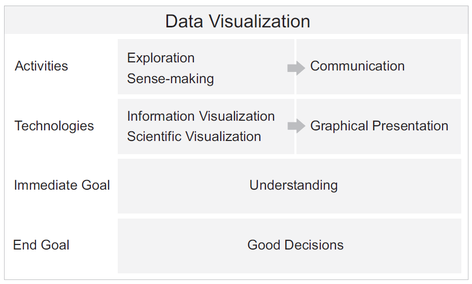
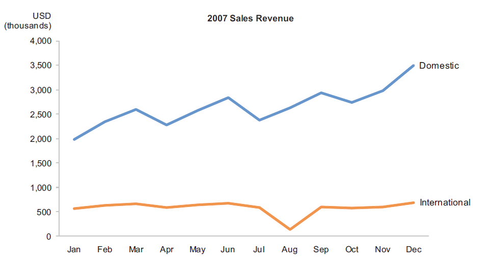
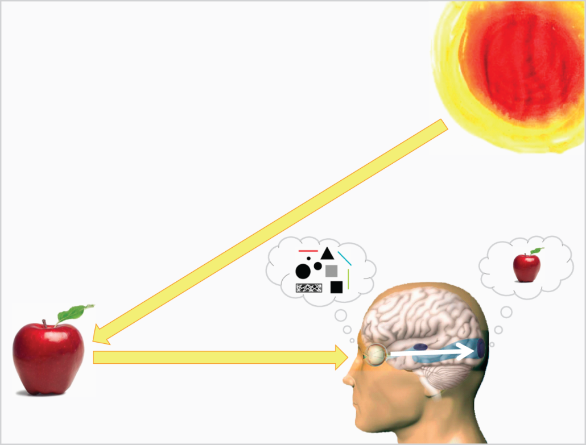
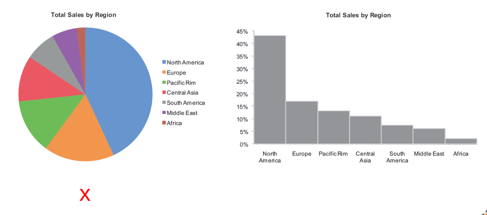
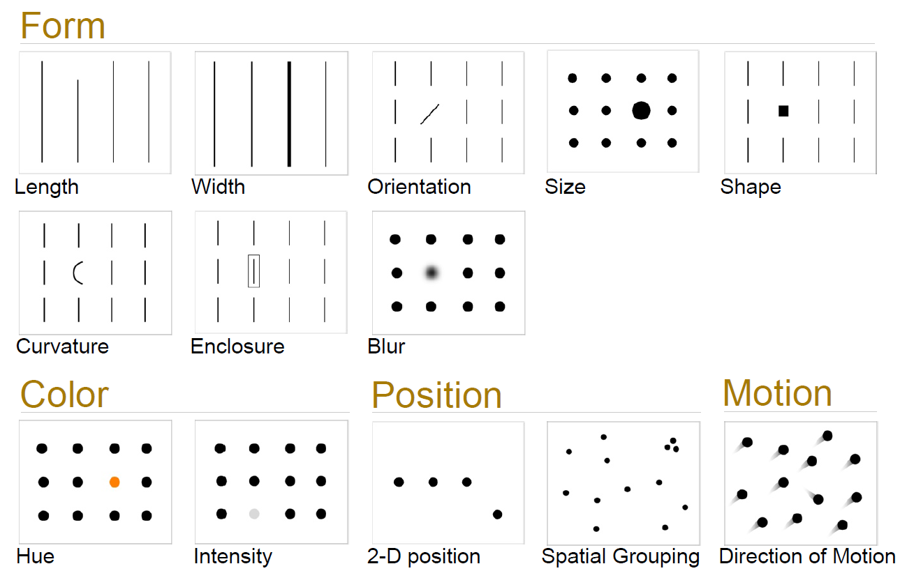
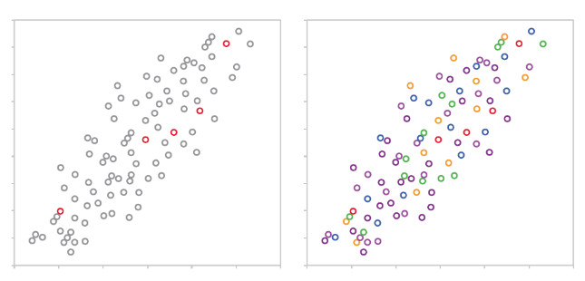

# College 1 - Information visualisation

## Meanings and uses of the term “visualization”:

> Information visualisation is  the use of computer-supported, interactive, visual representations of abstract data to 
amplify cognition (Card, Mackinlay and Schneiderman, 1999);

## Eisen

**Eisen voor het doen van Data Analyse:**

* Interesse 
* Nieuwsgierig 
* Analytisch 
* Synthetisch 
* Sceptisch 
* Patroon Herkenning 
*  Weten wat relevant is 
* Bekend zijn met de data 

**Eisen voor goeie data:**

* Hoog Volume (Heel veel data des te beter) 
* Historisch (Vergelijken met het verleden) 
* Consistent (Wat hetzelfde betekend moet hetzelfde betekenen) 
* Atomic (zo klein mogelijke data (per dagen niet per maanden)) 
* Van bekende Origin

## The power of visual perception

>  Tables work well for looking up individual values, and graphs work well for searching and making sense of relationships among values, and making comparisons between more than two values.

## How visual perception works

* Problem 1: only detail in fovea, and blind spot and saccades make us ‘blind’.
* Problem 2: visual working memory has a capacity of only three chunks.

> “Visual thinking consist of a series of acts of attention (visual queries), driving eye movements and tuning our pattern-finding circuits.”; and just enough and just in time

> See, Ware, 2008

## Making abstract data visible

* We see what we know and expect.

> A graph should support the tasks, and correspondent naturally to the workings of vision and cognition.

> Pre-attentive attributes are basic attributes of visualizations that  are processed prior to and without need for conscious awareness.

> Pre-attentive attributes, especially hue and shape, can be used for making objects in visualisations look distinct from one another.

> Pre-attentive attributes, especially length and 2-D position, can be used to represent quantitative values.

> Perception works not like a camera, but we see attributes like colour, length, etc., in the context what surrounds them, so attributes should vary significantly from one another, and 
the variety of distractors should be limited.

## Overcoming the limits of memory

Memory is divided in working memory and long-term memory; information in long-term memory is stored permanently and available for recall whenever it's needed; Information in working memory is stored briefly (few seconds) while we are  thinking about it, and when we think enough about it, it ends in long-term memory; Visual working memory has a capacity of three chunks;

Visualizations chunk information together and provide external storage, so avoid fragmenting information (placing on different screens or locations).
