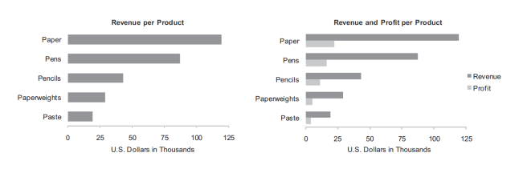
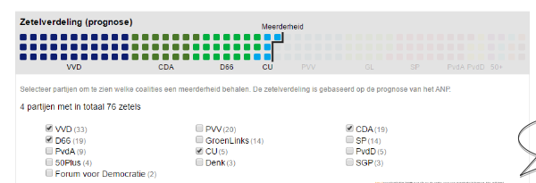
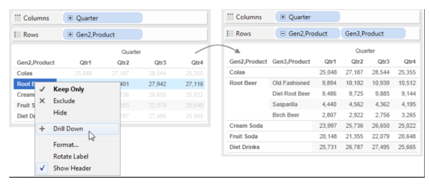
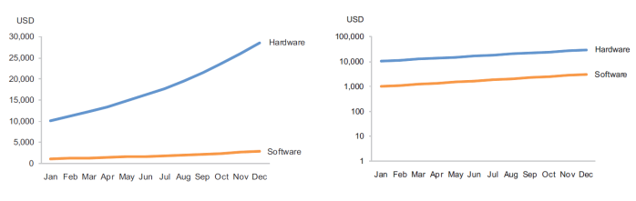
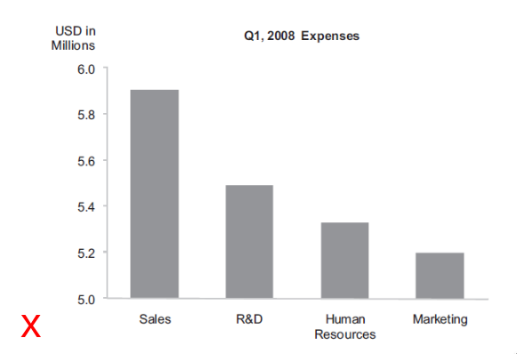
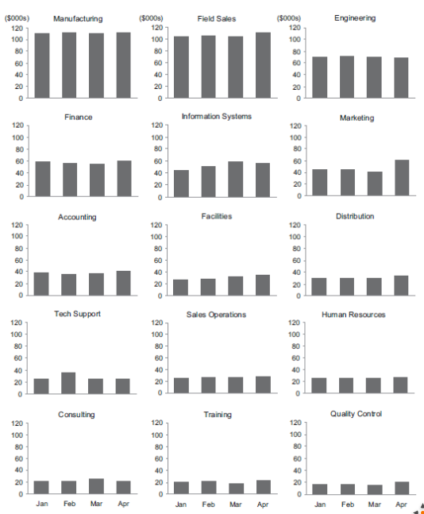
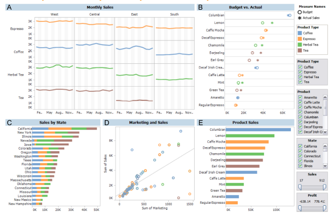
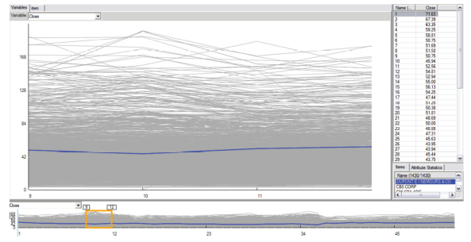

# College 2 - Data Visualization

## Analytical interaction and navigation

### Comparing

Comparing values and patterns happen very frequently, and should not be undermined by using 3-D or a base starting at a value other than zero.

### Sorting

Sorting shows how values relate to one another, and makes comparisons easier.

### Adding variables

Adding and removing variables is important because we don not always know in advance what we will need.

### Filtering

Filtering is to get information we do not need out of the way, by using radio buttons, sliders, etc.

### Highlighting

Highlighting makes it possible to focus on a subset of data while still seeing it in context of the whole.

### Aggregating

Aggregating is changing the level of detail.

### Re-expressing

Re-expressing is mostly changing the unit of measure, but could also involve calculations.

### Re-visualizing

Re-visualizing is switching from one type of graph to another. 

### Re-Scaling

Re-scaling often involves using a log scales to display time-series data, so we can easily compare rates of change.

### Directed vs. exploratory navigation

Directed analysis starts with a specific question and exploratory navigation starts with looking at the data.

* Directed: geeft de data direct op na een vraag. 
* Explored: Uitzoeken welke mogelijkheden beschikbaar zijn. Nadat je naar gegevens hebt gekeken (een vraag die opkomt nadat je naar de data ziet.)

### Scheinderman's mantra

Overview first, zoom and filter, then details on demand.

### Hierarchical navigation

Hierarchical navigation is to navigate through information from high-level view into progressively lower levels along an defined hierarchical structure and back up again, mostly with tree maps.

## Analytical techniques and practices

### Optimal quantitative scales

> When using a bar graph, begin the scale at zero, and end the scale a little above the highest value.

> With every type of graph other than a bar graph, begin the scale a little below the lowest value and end it a little above the highest value; Begin and end the scale at round numbers, and make the intervals round numbers too.

### Reference lines and regions

To make comparisons easier, include reference lines and reference regions.

### Trellises and visual crosstabs

> Splitting the data into multiple graphs that appear on the screen at the same time in close proximity to one another, so we can examine the data in any one graph more easily, and we can compare values and patterns among graphs with relative ease;

> trellis displays differ according to a single variable.

## Analytical techniques and practices Multiple concurrent views and brushing 

Faceted analytical displays combine multiple views of the same dataset on a single screen for analysis; faceted analytical displays include filtering and brushing; **if they are used for monitoring they are called dashboards.**

* Faceted Analytical Display wordt gebruikt om een dataset te onderzoeken. 
* Een Dashboard wordt gebruikt om data te monitoren. 
* Maar ze lijken beide wel op elkaar. 

### Focus and context together

> Analyse data while hold on to the big picture.