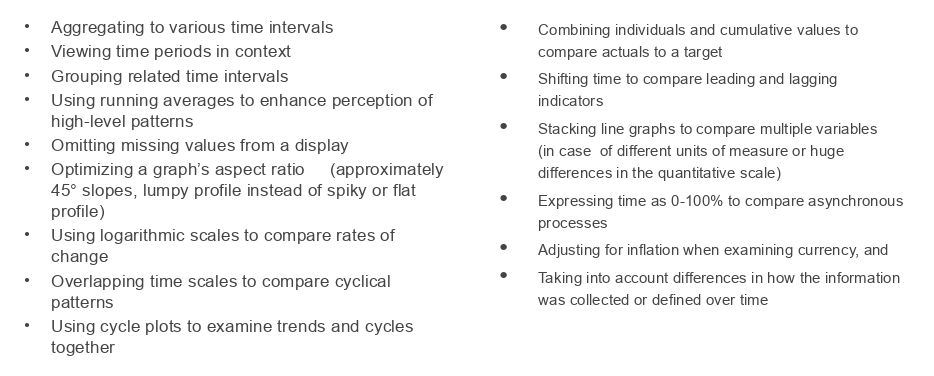

# College 3 - Data Visualization

## Time-series Analysis: Patronen

### Trendlijn 

> A trend is an overall tendency of a series of values to increase, decrease, or remain relatively stable during a particular period of time; 

line graphs (with trend line) work well for visualising trends. 

Trend bepaal je aan de hand van wat je ziet. Dus het hoeft geen absolute waarheid te zijn. 

### Variabiliteit 

> Variability is the average degree of change from one point in time to the next throughout a particular span of time; 

> line graphs with a scale starting at zero work well for visualising variability: more jagged, more variability;

beware of single jagged lines as the result of a narrow quantitative scale.

Veel variabiliteit tussen meetpunten en weinig, wiebelige lijn vs rechtelijn 

### Rate of Change 

> Rate of change from one value to the next can best be directly expressed as the percentage difference between the two. 

### Co-variation 

> Co-variation means that two time series are related to one another so that changes in one are reflected as changes in the other, either immediately or later (leading and lagging indicators) 

> Changes in one time series can move in a different direction from corresponding changes in the other. 

### Cycles 

> Cycles are patterns that repeat at regular intervals, are often easier to examine using visualizations, that display the interval at which the cycles occur. 

Dus bij patronen herkennen is het het makkelijkst om het overelkaar heen te leggen. 

### Exceptions

> Exceptions are values that fall outside the norm, and in time series they appear very explicit.

### Displays

> Use linegraphs for analysing patterns and exceptions, bar graphs for emphasizing and comparing individual values, dot plots for analysing at irregular intervals, and boxplots for analysing distribution changes. 

Als je op jaar basis bekijkt kun je andere patronen zien dan als je op week/dag basis kijkt. 

### Techniques and best practices

## Part to Whole and ranking  Analysis: Patronen

> Part-to-whole and ranking patterns are fairly simple and limited in scope, and the list above is not exhaustive.

## Displays

### Pie Charts

> Pie charts are not suited to express part-to-whole relationships, because the angles or 2D areas are not handled accurately or easily by perception, and adding values makes them obsolete.

### Bar charts and dot plots

> Bar charts are suited to express ranking and part-to-whole relationships; when the values fall within a fairly narrow range, and that is far from zero, use dot plots.

### Pareto Charts 

> Pareto charts are suited to express the cumulative contribution of parts, that are ranked by size, to the whole, starting with the largest and working sequentially to the smallest.

20% van de problemen heeft 80% dezelfde oorzaak. Etc. 

### Techniques and best practices

* Grouping categorical items in an ad hoc manner
* Using Pareto charts with percentile scales
* Re-expressing values to solve quantitative scaling problems
* Using line graphs to view ranking canes through time
