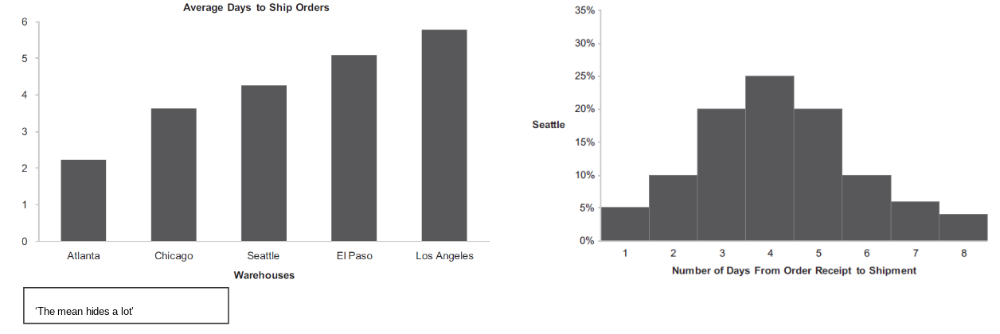
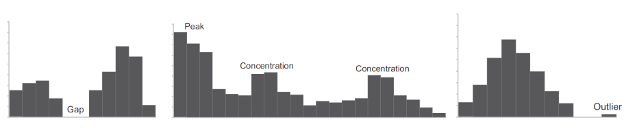
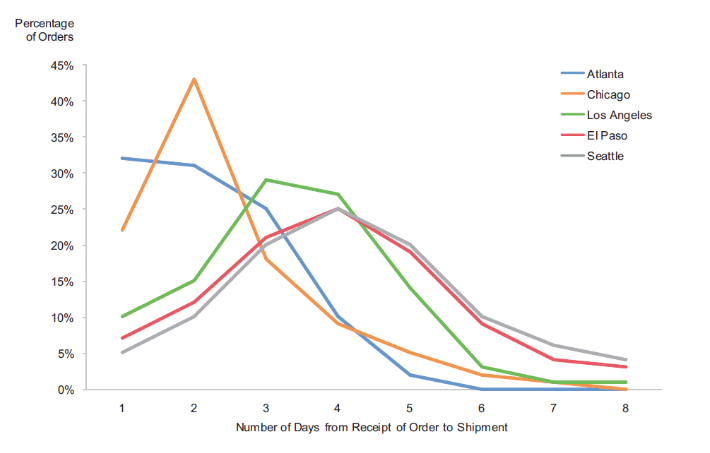

# College 4
## Deviation Analysis

> Deviation analysis is examining how one or more sets of values deviate fro a reference set of values, such as budget, current target, future target, current forecast, same point in time in the past, immediately prior period, standard norm, other items belonging to same category and others in the same category.

### Bar Graphs

Bar graphs can be used to express deviations; the reference line is usally set to value 0, 0% or 100%; Bar graphs can be used to encode data along norminal, ordinal and interval scales.

* Het kan handig zijn om het percentageverschil van het totaal te laten zien in plaats van het daadwerkelijke verschil.
	* 10% van 1.000.000
	* 10% van 100

### Line Graphs

> Line graphs should only be used to encode values along an interval scale, such as a time series and are preferable to bars when you wish to focus on the overall shape of the change rather tan on each individual value or camparison of individual values.

### Techniques and best practices

* Expressing deviations as percentages (when comparing deviations of more than one set of values because percentages normalize the data sets in a way that can make comparisons easier)
* Percentages work best when most of the values are less than or equal to 100% and exceptions do not  exceed a few hundred percent.
* Comparing deviations to other points of reference such as defined standards or statistical norms with reference lines or reference regions

## Distribution Analysis

> Distribution analysis is examining how sets of quantitative values are distributed from lowest to highest and how multiple sets of values are distributed.

* De balkjes worden aan elkaar geplakt om aan te geven dat er een volgorde in de gegevens zit.

### Discribing contributions

> A distribution can be described by spread, centre and shape.

### Shape

> A distribution can be curbed or flat, if curved, upward or downward, if curved upward, single or multiple peaked, if single peaked, symmetrical or skewed. 
> see: NYSI for examples

### Concentrations, gaps and outliers

### Illusory superiority

> Illusory superiority is a congnitive bias whereby, individuals overestimate their own qualities and abilities, relative to others, but distribution analysis tells another story.

### Histograms

When bars are used to display a distribution, the graph is called an histogram, and they do a god job displaying the overall shape of a distribution while also making it easy to compare the magnitudes of individual intervals; but, we cannot see a measure of the distribution’s centre, nor precisely the distribution’s spread (without enhancement).

> Enhancement: red lines mark the low, median, and high values in the distribution,

### Frequency Polygons

> Frequency polygons express mainly the distribution’s shape, but does not support magnitude comparisons between intervals very well, and we cannot see a measure of the distribution’s centre, nor precisely the distribution’s spread (without enhancement).

### Stem-and-leaf plots

* Bedoelt voor 100 of minder waarden

### Multiple distribution displays

#### Boxplots

> Box plots support the examination and comparison of several distributions.

#### Shape comparisons

> For distribution shape comparisons, nothing beats a trellis arrangement of line graphs (or bar graphs as a series of histograms), but for shape and magnitude comparisons, single graphs like a frequency polygon will usually do the job better.

### Techniques and best practices

Keeping intervals consistent (it is acceptable to break the rule when the vast mahority of values fall within a particular range but a few outliers extend the overall spread far into the distance)

#### Het kiezen van de beste intervals

