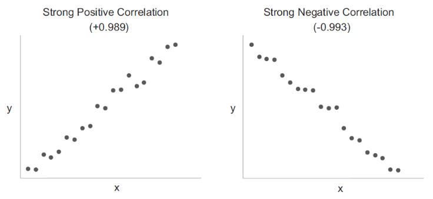
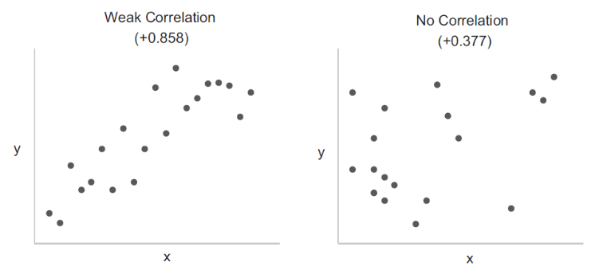
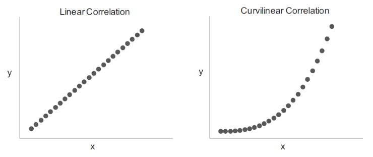
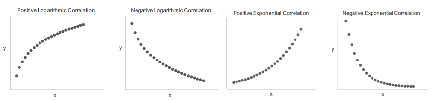
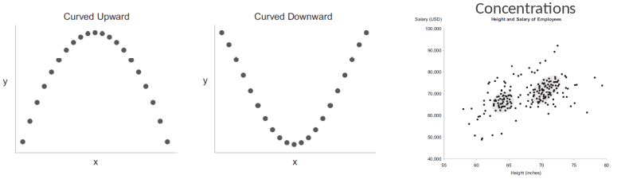
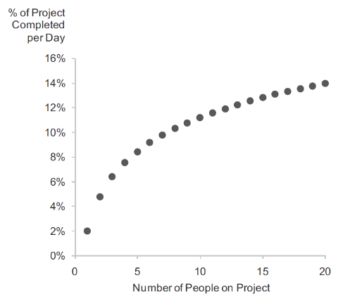
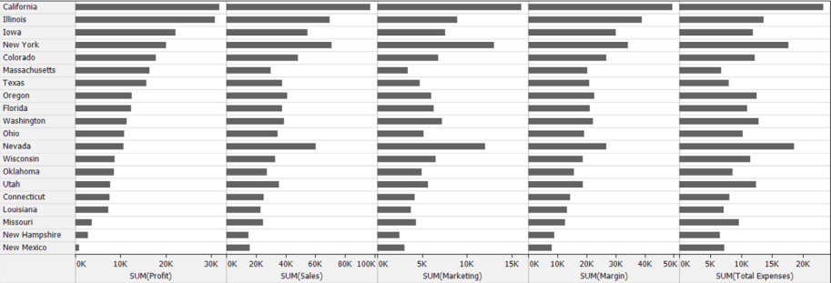
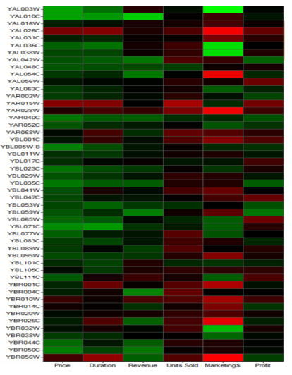
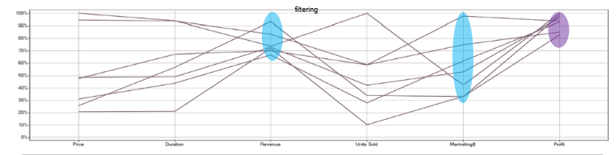

# College 5
## Correlation analysis

### Introduction

Correlation analysis looks at how quantitative variables relate to and effect one another, and is one of our best means tot track down causes of problems.

A variable that is caused is called the depended variable and the other the independent variable.

When two variables are correlated the nature of that relationship is not necessarily causal;

* Both are caused by one or more variables (spurious correlation, confounder)
* Another variable connects them (mediator)
* the apparent correlation is erroneous because of an insufficient or biased sample

### Describing Correlations

#### Direction

> A correlation can be positive or negative, or both.

#### Strength

> A correlation can be strong, weak and absent.

#### Shape

> A correlation can be linear or curvilinear.

### Patterns

### Scatterplots

> Scatterplots are very well suited to display relationships between two quantitative variables. 

### Table lenses

> Table lenses are  suited  for comparing more than two variables simultaneously,but not as richly and precisely as scatterplots do.

### Best Practices

* Optimizing aspect ratio 
	- (equal height and width) and 
	- quantitative scales 
	- (begin each scale just a little below the lowest value and end it just a little above 		the highest)
* Removing fill colour to reduce over-plotting
* Comparing data tot reference regions
* Visually distinguishing data sets when they are divided into groups
* Using trend lines to enhance perception of the correlation’s shape, strength, and outliers
     (choose the appropriate fit model: linear, logarithmic, exponential, or polynomial, and check r²)
* Using multiple trend lines tot see categorical differences
* Removing the rough tot see the smooth more clearly
* Using trellis and crosstabs displays to reduce complexity and over-plotting
* Using grid lines to enhance comparisons between scatterplots

## Multivariate analysis

### Introduction

Multivariate analysis compares multiple instances of serval variables at once  to identify similarities and differences among items, each characterized by a common set of variables.

To answer questions like:

* Which items are most alike?
* Which items are most exceptional
* How can the items be combined into logical groups based on similarity?
* What multivariate profile corresponds best to a particular outcome?

### Displays

#### Heatmaps

A heatmap encodes quantitative values of variables (for example price, revenue, profit) 
as variation in colours (for example green is higher-than-average, black is near-average, and red islower-than-average), to express the multivariate profile of an item (for example products);

A heatmap can reveal exceptions and predominant multivariate patterns, but its usefulness for multivariate analysis is still limited, because it's difficult to see the combination of colors for particular items as a pattern.

#### Parallel coordinates plots

Parallel coordinates plots can be used to determine similarities or differences among items, find predominant patterns and exceptions, and look for multivariate profiles that correspond to a particular condition.

### Techniques and best practices

*  Ranking items by similarity
* Clustering items by similarity

