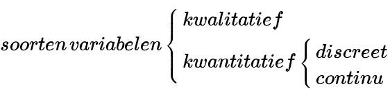
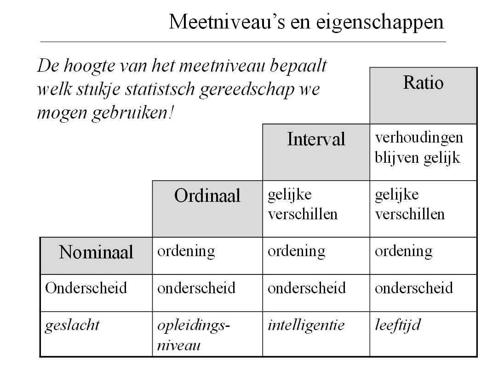
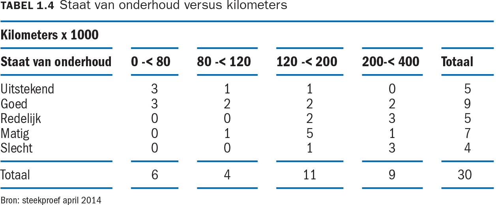
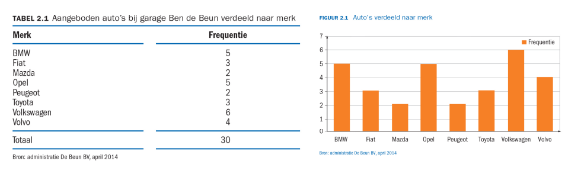
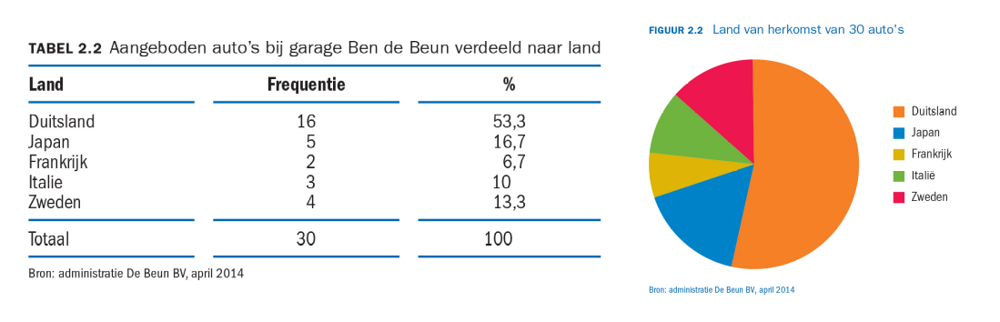
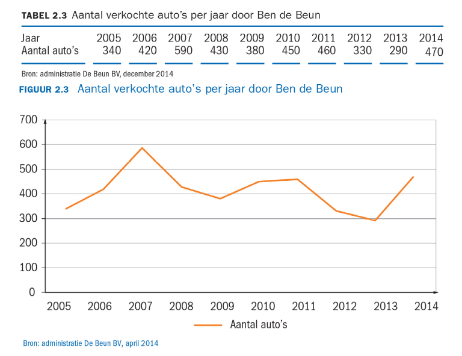

# Statistiek
## Week 1 - Variabelen en Grafieken

### Basisbegrippen

* **Populatie**: Totale collectie waar het onderzoek over gaat
* **Steekproef**: Gebruik een representatieve subset van het geheel

* **Kwalitatief**: Volvo, Blauw, Slechte onderhoud
* **Kwantitatief**: Bouwjaar, Kilometerstand, Prijs
* **Continu**: Alle tussenliggende waarden zijn in theorie mogelijk
* **Discreet**: Sommige tussenliggende waarden zijn in theorie niet mogelijk

### Variabelen

#### Meetniveau's

* **Nominaal**: De denkbare uitkomst kan niet op een logische manier op volgorde worden gezet.
	- Bijvoorbeeld: automerken
* **Ordinaal**: Bij een ordinale schaal is er een vaste volgorde die niet kwalitatief is.
	- Brons > Zilver > Goud
* **Interval**: Een intervalschaal heeft geen natuurlijk nulpunt.
	- Datums, Graden Celsius
* **Ratio**: Een ratio heeft een natuurlijk nulpunt.
	- Kelvin, Leeftijd

##### Toegestane operaties bij meetniveau's

|                             | Nominaal | Ordinaal | Interval | Ratio |
|-----------------------------|----------|----------|----------|-------|
| Frequenties, Modus          |YES       |YES       |YES       |YES    |
| Mediaan en percentielen     |NO        |YES       |YES       |YES    |
| Optellen, aftrekken         |NO        |NO        |YES       |YES    |
| Gemiddelde, std.dev         |NO        |NO        |YES       |YES    |
| Variatie-coefficient, delen |NO        |NO        |NO        |YES    |

### Tabellen

* Wat maakt een goede tabel?
	- Titel
	- Kolomnaam
	- Totaalregel
	- Goedgekozen klassen
	- Bronvermelding

> Voorbeeld van een goede (kruis)tabel.

### Grafieken

* Wat maakt een goede grafiek?
	- Titel
	- Bron
	- Label op de assen (welke variabele en eenheid)
	- Nummers op de assen (en nulpunt of zigzaglijn)
	- Legenda (bij meerdere kleuren)

#### Meest gebruikte grafieken bij meetniveau's

* Staafdiagram: Ordinaal & Nominaal
* Cirkeldiagram: O&N, relatieve frequenties;
* Lijndiagram: Interval & ratio (vaak variabele over tijd)
* Spreidingsdiagram: 2 variabelen tegen elkaar
* Histogram: interval of ratio

#### Voorbeelden

**Staafgrafiek (Nominaal)**

**Piechart (Nominaal / rel. frequentie)**

**Lijndiagram (Interval)**

