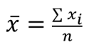
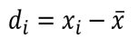
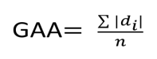
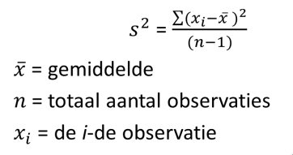
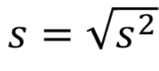
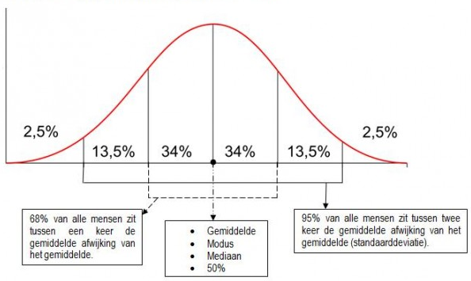

# Statistiek
## Week 2: H3 - Centrummaten en Spreidingsmaten

### Centrummaten

* **Rekenkundig gemiddelde**: 
	- Sigma is het symbool voor sommatie
* **Mode/Modus**: Het meest voorkomende getal
	- Niet per se uniek
* **Mediaan**: Het exacte midden van een reeks observaties
	- Sorteer data voor je de mediaan bepaalt!
	- Bij even aantal observaties: neem gemiddelde van middelste twee.

#### Toegestane operaties

|            | Nominaal | Ordinaal | Interval | Ratio |
|------------|----------|----------|----------|-------|
| Modus      |YES       |YES       |YES       |YES    |
| Mediaan    |NO        |YES       |YES       |YES    |
| Gemiddelde |NO        |NO        |YES       |YES    |

### Spreidingsmaten

* Wat is de spreiding van de dataset? Verschillende maten:
 	- Variatiebreedte (ook wel: range, spreidingsbreedte)
	- Deviatie
	- Variantie
	- Standaard deviatie

#### Variatiebreedte (Range)

* MAX - MIN (Grootste - Kleinste waarde)
* Heeft geen betrekking tot concentratie tussen de max en min waarden

#### Deviatie (Afwijking van het gemiddelde)

Deviatie per datapunt: 

Gemiddelde Absolute Afwijking: 

* De verticale lijnen geven aan dat de mintekens bij het optellen van de deviaties moeten verdwijnen. Anders is de uitkomst 0, waar men geen gemiddelde mee kan berekenen.

#### Variantie

* De som van alle deviaties komt altijd op 0 uit.
* GAA is hier een oplossing voor, echter standaard wordt in de statistiek de variantie gebruikt als maat van spreiding: 

> Bij het berekenen van de variantie (en tevens de rest van statistiek) is het handig om een tabel te maken van de gegevens die je moet invullen op de rekenmachine.

#### Standaarddeviatie (std)

* De standaarddeviatie: 

> oftewel bereken eerst de variantie en neem hier de wortel van.

**Vuist regels bij de standaarddeviatie**

1. Begin bij het gemiddelde
2. Vind de ondergrens L = gem. - 2*std
3. Vind de bovengrend R = gem. + 2*std
4. Ongeveer 95% van de observaties liggen tussen L en R.

#### Normale verdeling

