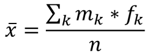
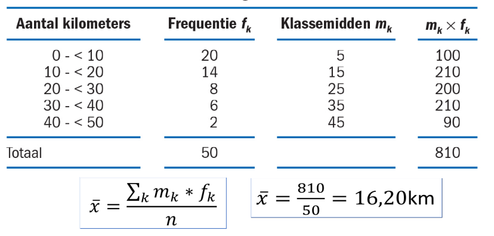
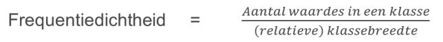
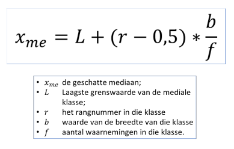
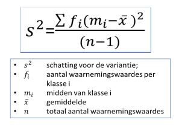
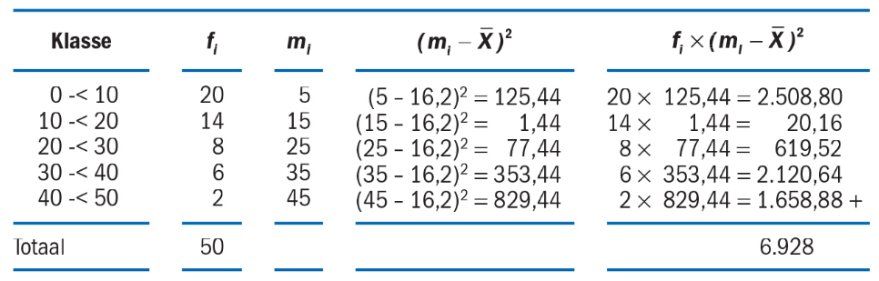
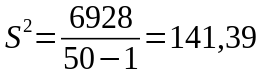
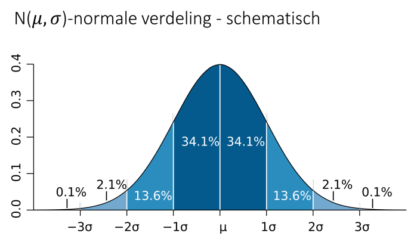
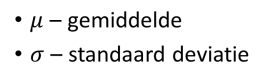
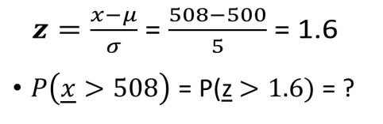

# Statistiek
## Week 3: H4, H8 - Frequentieverdeling en Normaalverdeling

### Frequentieverdeling

#### Gemiddelde bij frequentieverdeling

Gewogen gemiddelde: 

Voorbeeld:

#### Modus bij frequentieverdeling

* Wat is de modale klasse?
	- Als de breedte van de klassen gelijk is voor alle klassen, dan is de modale klasse die met de meeste waarnemingswaardes.
	- Als de breedte van de klasse niet gelijk is voor alle klassen, bereken dan eerst de frequentiedichtheid. De modale klasse is de klasse met de hoogste frequentiedichtheid.

* Wat is de modus?
	- De middelstewaarde van modale klasse wordt beschouwd als de modus.
	- **Let op:** Dit kan meer dan 1 waarde zijn!

> Modale klasse is dus iets anders dan de modus.

#### Mediaan bij frequentieverdeling

* Wat is de mediale klasse?
	- Tel het aantal waarnemingen (alle frequenties) bij elkaar op en neem hier het midden van. Kijk naar het aantal waarnemingen in de onderliggende klassen en zoek zo de klasse waar deze middelste waarneming in zit.
	- Wanneer er twee middelste waarnemingen zijn, bij een even aantal waarnemingen dus, neem je hier het gemmiddelde van.

* Wat is de mediaan?
	- De mediaan is een waarde in de mediale klasse.
	- De mediaan is NIET de middelste waarde in de mediale klasse. De mediaan bereken je namelijk met de volgende formule:

> **Let op:** deze formule geeft een geschatte waarde voor de mediaan. Deze schatting gaat uit van aannames omtrent de  gelijkmatige verdeling van waarnemingen binnen de klasse, maar blijft een – weliswaar onderbouwde – schatting.

#### Variantie bij frequentieverdeling

Voorbeeld:

> **Let op:** Wanneer je werkt met discrete variabelen inplaats van continu, dan is het klassen midden van 10-<15 **niet 12,5 maar 12** omdat 15 dan zelf niet onderdeel van de klasse is!

### Normaalverdeling

#### Kansvariabelen

* Discrete variabelen: Wat is de kans op een 6 bij het gooien van een dobbelsteen?
* Continu variabelen: Wat is de kans dat een Nederlands vrouw langer is dan 185cm?

#### Kenmerken van de normale verdeling

* Totale oppervlakte onder de grafiek is **1**
	- Het totaal van alle kansen is gelijk aan 1 (of 100%)
* De kans van een individuele uitkomst is 0
	- P(x) = 165 is dus 0
* Gebruik daarom strikte ongelijkheden:
	- P(158 < x < 168)
* De normale verdeling is spiegel symmetrisch dit betekend dat 25% van de populatie aan de ene kant is even groot als 25% van de populatie aan de andere kant.

Voorbeeld:

* Een machine dat koffiepakken vult, vult de pakken met gemiddeld 500g koffie, met een standaarddeviatie van 5g.
* Welk percentage van de koffiepakken heeft een gewicht van meer dan 508 gram?
* *x* is vulgewicht van koffiepak
* We willen weten: P(*x* > 508)

1,6 in de Z-tabel P(*z* > z) heeft een oppervlakte van 0,0548 van het geheel

> Als je nu wil weten wanneer een koffiepak een gewicht heeft van minder dan 508 gram doe dan: 1 - 0,0548 = 0,9452

