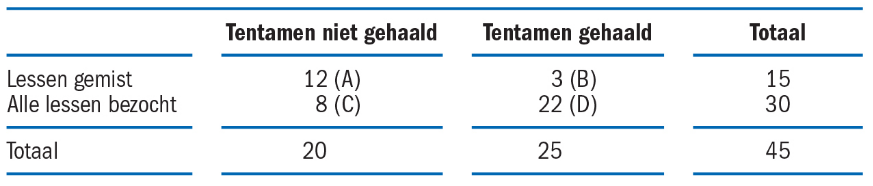
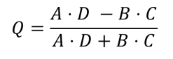
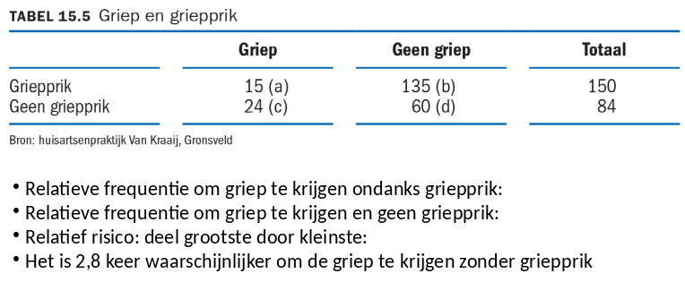
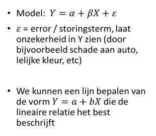
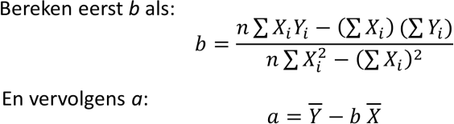
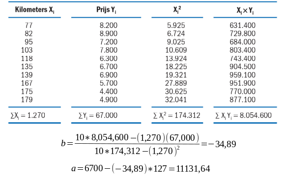
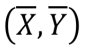
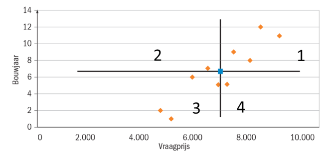
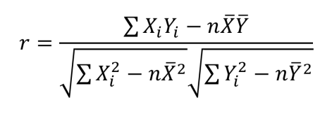

# Statistiek
## Week 4 - Associate en Regressie + Correlatie

### Associatie (Kruistabel, Maatstaf van Yule, Relatief Risico)

Als je verschillende kenmerken van een populatie hebt…

* Is er een relatie tussen de kenmerken?
	- Is er een relatie tussen het inkomen en rookgedrag van mensen?
	- Is er een relatie tussen het slagen voor een tentamen en het aantal keer dat een student een les bijwoont?
* Analysemethode hangt af van type variabele: nominaal, ordinaal, interval of ratio

#### Kruistabel & Maatstaf van Yule

Hoe kunnen we de onderlinge relatie tussen combinaties meten?

Dit kan met de maatstaf van Yule (Yule's Q): 

| Uitkomst | Interpretatie |
|------------------|----------------------|
| 0,00 < Q < 0,25 | Vrijwel geen verband |
| 0,25 <= Q < 0,50 | Zwakke samenhang |
| 0,50 <= Q < 0,75 | Redelijke samenhang |
| 0,75 <= Q < 1.00 | Sterke samenhang |

Maar vaak is data niet gegeven als een 2x2 tabel...

* Transformeer een niet 2x2 tabel in een tabel met klassen

#### Relatief Risico (Ratio tussen kansen)

### Regressie

#### Associatie vs Regressie

* Associatie
	- Relatie tussen nominale en/of ordinale variabelen
	- Interpretatie van relatie
* Regressie
	- Relatie tussen interval en/of ratio
	- Relatie beschrijven en voorspellingen doen

#### Bepalen van X en Y

* X is oorzaak
	- Onafhankelijke variabele
* Y is gevolg
	- Afhankelijk variabele
	
> Hangt de prijs van een auto af van het aantal gereden kilometers?

> X = aantal gereden kilometers, Y = de prijs van de auto

#### Lineaire regressie model

#### Bereken van a en b

Het ziet er complexer uit dan het is: Maak gewoon weer een tabel met alle berekende waarden:

#### Is regressie zinvol?

* Als er de correlatie van de gegevens niet hoog genoeg is misschien niet.
* Misschien is de relatie wel niet linear

### Correlatie

#### Zwaartepunt

* Het zwaartepunt ligt op het gemiddelde van x en het gemiddelde van y: 
* Met dit punt kun je het spreidingsdiagram in kwadranten verdelen:

#### Correlatiecoëfficiënt

| Uitkomst | Interpretatie |
|----------------------|----------------------|
| 0 <= abs( r ) < 0.30 | Vrijwel geen verband |
| 0.30 <= abs( r ) < 0.70 | Zwakke samenhang |
| 0.70 <= abs( r ) < 1.00 | Lineair verband |

> Aandachtspunt: Correlatie betekend geen  causatie!