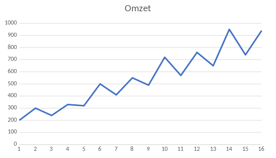
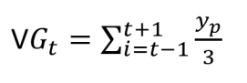
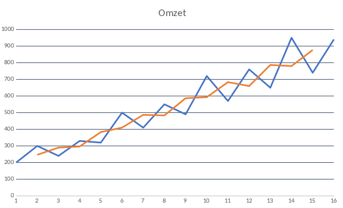
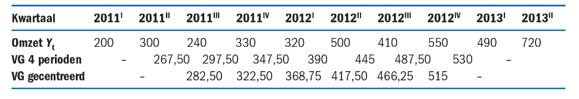
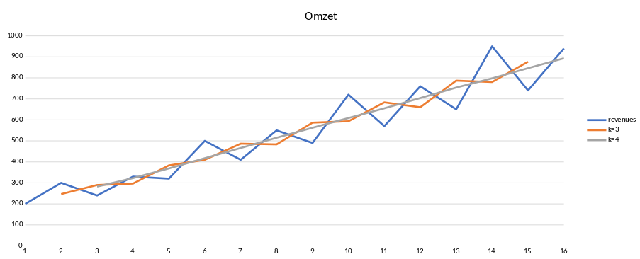
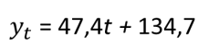
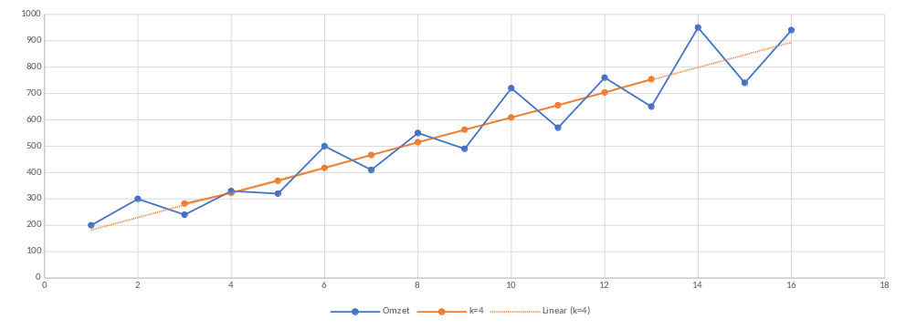
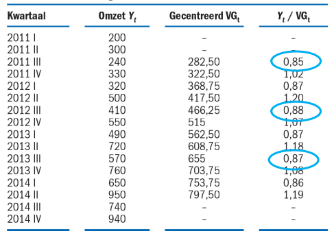
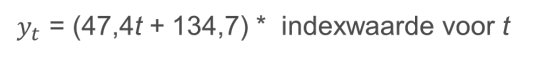

# Statistiek
## Week 5 - Tijdsreeksen

### Patronen in data

Als je de grafiek hiervoor bekijkt zie je twee patronen:

* Een golvend patroon (de periodiciteit)
* Een graduele stijging (de trend)

Voor een voorspelling dienen we beide patronen te modelleren

#### Voortschrijdend gemiddelde

* Waarom: Hiermee demp je sterke fluctiaties in het patroon
* Hoe: Door steeds het gemiddelde te nemem van k opeenvolgende waarnemingen

dit geeft:

#### Gecentreerd voortschrijdend gemiddelde

* Bij een even waarde voor k valt het voortschrijdend gemiddelde niet samen met een meetmoment opde tijdsas. Dit is zichtbaar gemaakt in de tavel hieronder, hier k=4:

#### Het maken van een model

* Maak gebruik van lineaire regressie om een voorspelling te doen over de omzet.
* We kunnen VGc weergeven met een lijnfunctie, waarbij we in plaats van *x* een *t* gebruiken.

* In de volgende grafiek is zichtbaar dat daarmee al het fluctuerende (ook wel periodieke) gedrag is verdwenen:

#### Modelleren van de periodiciteit

* De index geeft aan hoe de echte omzet in een kwartaal zich verhoudt tot het gecentreerd voorschrijdend gemiddelde:

> Het patroon komt dus duidelijk terug in Yt / VGt

#### Het gecombineerde model

Om te voorspellen gebruiken we zowel de trend als de periodiciteit

#### Samengevat

* Stel het trendmatige gedrag vast. 
	- Omdat het om kwartaaldata gaat gebruik je daarbij   en  bereken je het voor de hele reeks.
	- Hieruit leid je de functie voor de trendlijn af
* Stel het periodieke gedrag vast.
	- Bereken de indexcijfers voor elk kwartaal. 
	- Bereken vervolgens het gemiddelde indexcijfer van alle kwartalen I (en II en III en IV).
* De functie die toekomstig gedrag het best voorspelt is de functie voor de trendlijn gecorrigeerd met een corresponderend indexcijfer.