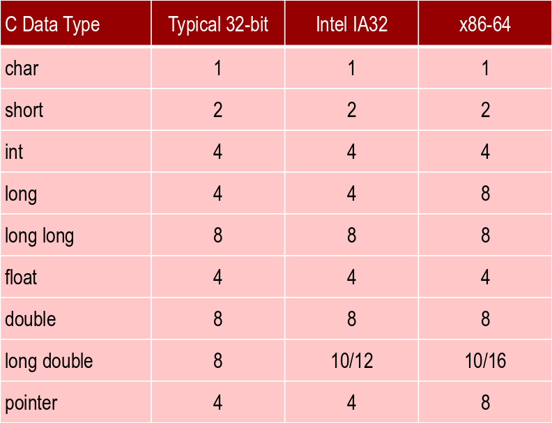
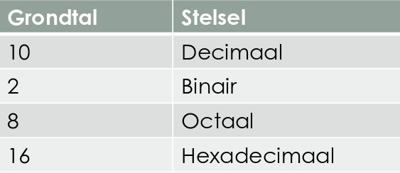
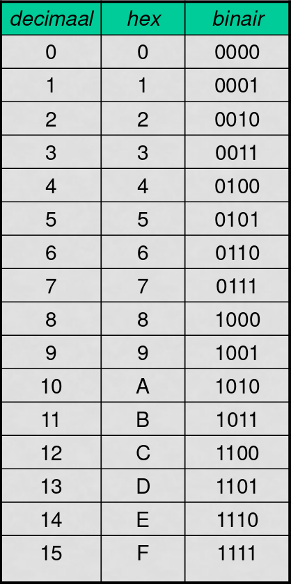
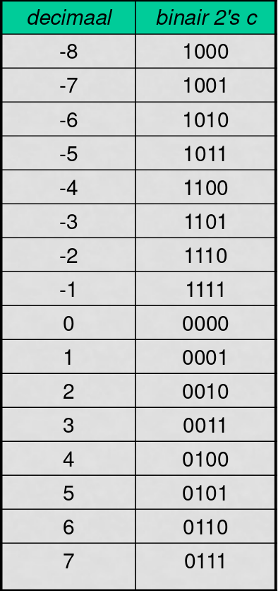
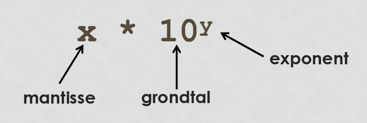

# Computer Systems - Week 1

## Codering

* Computers zijn voor rekenen
* Voor tekst
* Voor beeld
* Voor geluid
* Maar uiteindelijk is dat allemaal rekenen

### Digitaliseren

1. Zet alles om naar cijfers
2. Maak de cijfers binair

### 0 & 1

* stroom [0v, 5v]
* DVD [Putje, Niet Putje]
* HDD [N orientatie, Z orientatie]

> De reden voor digitaliseren implaats van analoog blijven is betrouwbaarheid / storingsongevoelig

|Positie|Naam|Combinatie|
|---|---|---|
|1|bit|2^1|
|4|nibble|2^4|
|8|byte|2^8|
|Register Breedte|naam|2^n|

### Meerdere bytes



### ADC & DAC

* ADC: Analog to Digital Converter
	- Microfoon kan trillingen omzetten naar signaal
* DAC: Digital to Analog Converter
	- Speaker kan signaal omzetten naar trillingen
	
## Talstelsel

### Decimale Stelsel

* 15671
	- grondtal is 10
	- `1*10^4 + 5*10^3 + 6*10^2 + 7*10^1 + 1*10^0`
	
### Andere Stelsels



### Van decimaal naar binair

1. Delen en rest noteren
2. Herhaald aftrekken

```
54

54/2 = 27		r0
27/2 = 13		r1
13/2 = 6		r1
6/2  = 3		r0
3/2  = 1		r1
1/2  = 0		r1
------------------
			110110
```

### Hexadecimale Stelsel

* grondtal 16
* Symbolen: **0123456789ABCDEF**
* wordt vaak aangegeven met **0x**FF of met **$**
* wordt b.v. gebruikt bij IPv6 adressen



### Octale Stelsel

* grondtal 8
* Symbolen: **01234567**
* Wordt gebruikt voor file-system permission op unix(-like) systemen

### Binair

* grondtal: 2
* Symbolen: **01**

### Overflow

stel we hebben registers met een breedte van 4 bit

* 15 + 2 = 17, dit past niet meer in het 4-bit register
* dit 'niet-meer-passen' noemen we overflow

### Binair vermenigvuldigen

```
    11001
    01101
    -----x
    11001
   000000
  1100100
 11001000
000000000
---------+
101000101 (325)
```

### Binair delen

* stadelingen

```
11 / 1111110 \ 0101010
     1......
     11.....
      01....
       11...
        01..
         11.
          00
```

### Binair aftrekken

* De ADD op de chip wordt ook gebruikt voor aftrekken
* Signed magnitude
	- gebruik maken van een bit om aan te geven of het getal negatief is.
		+ +99 = 0110 0011
		+ -99 = 1110 0011
* One's Complement
	- inverteert bits voor de negatieve variant
		+ +99 = 0110 0011
		+ -99 - 1001 1100
	- probleem: 0000 0000 en 1111 1111 zijn beide 0
* Two's Complement
	- inverteren en +1
		+ +99 = 0110 0011
		+ -99 = 1001 110**1**
	- voordeel: optellen = eenvoudig
		+ Aantal negatieve getallen is 1 hoger dan het aantal positieve getallen
		+ Er is nu geen dubbele 0



### Floating point formaat (Drijvend komma getal)

```
float x = 0.4-0.3;
float y = 0.3-0.2;

if(x==y)
	printf("gelijk");
else
	printf("ongelijk");
	
------output-------
ongelijk
```



### IEEE Floating Point Format

|Teken|Exponent|Mantisse|
|---|---|---|
|1|8|23|

### Decimaal naar FP

...

## Tekst & Tekens

### ASCII

* American Standard Code for Information Interchange.
	- karakters
* 7 bits code -> 2^7 karakters

### Unicode

* Ruim 1,1 miljoen tekens
* Ondersteunt alle schriften (latijns, chinees)
* unicode.org
* codering: UTF-8. UTF-16

|Bits|Sequence|
|---|---|
|0|1|
|110|2|
|1110|3|
|11110|4|
|10|Aanhangwagen|
