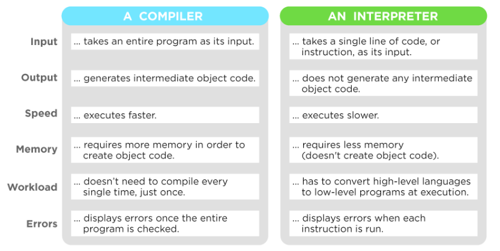
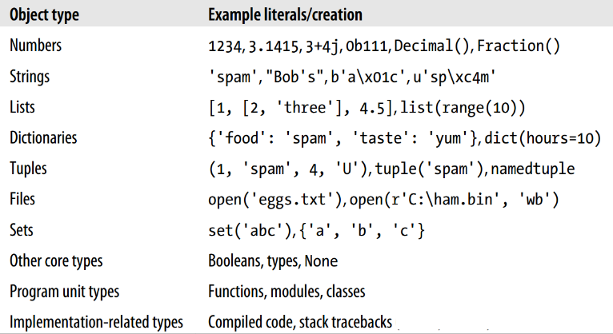
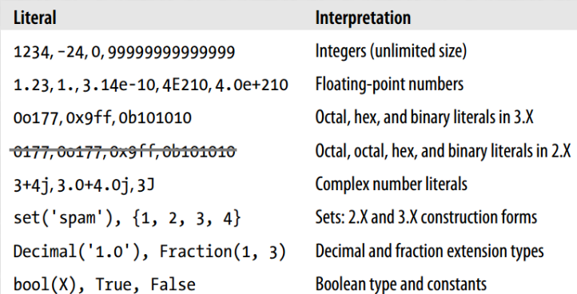
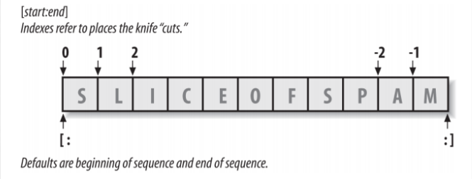
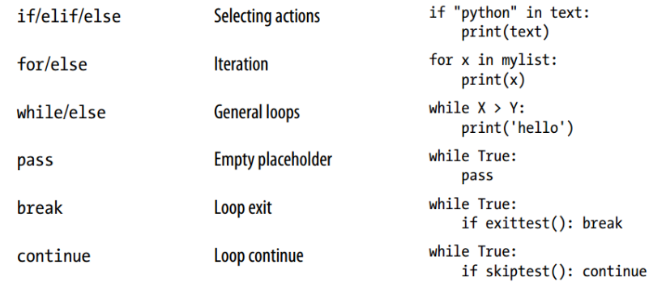

# Python - Week 1

## Features

### Overview

**A general purpose, interpreted, high-level programming language**

* Esp. system programming, internet scripting and scientific programming
* Open-source
* Maybe the most versatile and capable all-rounder
* Created by Guido van Rossum

Uses dynamic typing

* multi-paradigm: object-oriented, imperative, functional, procedural, reflective
* automatic memory management (garbage collection)

### Interpreter vs Compiler

* Java -> Compiler -> bytecode -> JVM -> run
* Python -> Interperter (PVM) -> run

#### Compiler

* translates source code to machine code, but does not execute the source code
* translation at compile time takes a lot of time, but execution at run time is fast
* does some memory management e.g. register allocation and code optimization

#### Interpreter

* translates source code into an immediate language ('bytecode') and immediately executes this.
* interpreting a program is much slower than executing native machine code
	- interprets (=executes) one line ata a time from the source file
	- interpreter must analyze each statement in the program each time it it sexecuted and then perform the desired action. ~100x slower
* development generally much quicker
	- edit-interpret-debug vs. edit-compile-run-debug
	
#### Side by Side



### Python vs. Java

Variables

* Java: all variable must be explicitly declared
* Python: you never declare anything; an assignment statement binds a name to an object

Collections

* Java : collections can only hold objects, not primitives such as int
* Python : container objects (e.g. lists and dictionaries) can hold objects of any type

#### Voorbeeld

```
lijstje = [5, 7, 9, 10]
lijstje.append('piet')
print(lijstje)

-----output-----
[5, 7, 9, 10, 'piet']
```

```
# most_common_words.py
from collections import Counter

num_words = 10
with open('astronaut.txt', 'r') as f:
	counter = Counter(word.lower()
				for line in f
				for word in line.strip().split()
				if word)
				
for word, count 
```

### Built-in Types



### Mutable vs. Immutable

* numbers, strings and tuples are immutable
	- every string assignment results in a new string
	- every number assignment results in a new number
* lists, dictionaries and sets are mutable
	- they can be changed in place after they are created
	
### ==, = en is

* **is** will return True if two variables point to the same object,
* **==** if the objects referred to by the variables are equal.
* **=** sets the value to the left to the value on the right.

### Numeric types



### Booleans

* booleans: True or False
* zero numbers, empty objects/collections/strings, and object None are evaluated as False
* any nonzero number or nonempty object is True

### Numbers

```
import math

pi = math.pi
print(pi)

-----output--------
3.141592653589793
```

### Strings

```
# gegeven L = ['x', 'y', 'z'] hoe krijg je de string 'xyz'?
>>> "".join(L)'

# gegeven L = ['a','b','c'] hoe krijg je de string 'a,b,c'?
>>> ",".join(L)
```

### Indexing and Slicing



**All sequences support slicing. **

### Sequences

Een sequence is een verzameling van meerdere dingen en het heeft een volgorde.

* strings, lists and tuples are all sequences
* All sequences support slicing: ``L[start:stop]`
* Elements of sequence have an order
* Dictionaries are not sequences, elements have no order

```
for i in range(0, 10)
	print(i)
	
for i in range(0, 10, 2)
	print(i)

e = [0, 1, 2, 'hoi', 3]	
for i in e
	print(i)
```

#### Slicing

```
str = [0, 1, 2, 3, 4, 5]
e = str[2:3] # 2 tot 3 (niet t/m)
print(e)

-----output------
[2]
```

```
e = str[2:]
print(e)

-----output------
[2, 3, 4, 5]
```

```
e = str[:-1]
print(e)

-----output------
[0, 1, 2, 3, 4]
```

```
>>> s = 's'
>>> s[:]
's'
>>> s + s[0:-1+1]
's'
>>> s[0:]
's'
>>> s[:-1]
''
>>> s[:3] + s[3:]
's'
```

* some sequences also support 'extended slicing' with a third 'step' parameter: `L[start:stop:step]`
	- step < 0: direction is from right to left
	
### Printing stuff

`print('first argument: { 0 }, second one: { 1 }'.format(47, 11))`

### Control statements



> Verschil tussen break en continue is dat break de hele loop afbreekt, en continue alleen de momentele enumeratie, dus die begint gewoon weer van boven aan de loop.

### For

* A for loop can step across any kind of sequence object

```
for target in object:
	statements
	if test: break
	if test: continue
else:
	statements
	
#else: Als hij het hele lijstje af heeft gemaakt. (dus als er geen break is gebruikt.)
```

### While

* Niet een while gebruiken als je een sequence doorloopt.

```
while test:
	statements
	if test: break
	if test: continue
else:
	statements
```

### Tuples

* Tuples are like a lists, but **immutable**
	- once a tuple is created, you canno add, delete raeplace o r reoerder lelemetns
	- tuple is an (immutable) sequenc
* a list uses [..], a tuple uses (..)
* can be used as:
	- immutable lists
	- records with no field names
		+ ('KL 659', 'AMS', '15:30', 'JFK', '22:10')
	- returning multiple values from a function
		+ return x, y, z
